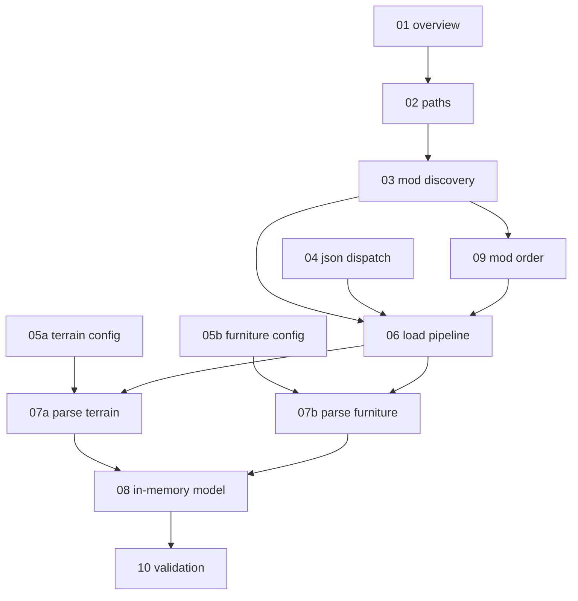

# Game data loader specification — index and progress

Language-agnostic documentation extracted from Cataclysm-BN for reimplementing **game JSON
data loading** in another runtime. Each linked unit is a self-contained spec: inputs,
outputs, failure modes, and source references.

**Implementing in this repo?** Start with
[implementation-plan.md](./implementation-plan.md) — Java code under
[`core/src/main/java/io/gdx/cdda/bn/nextgen/gamedata/`](../../core/src/main/java/io/gdx/cdda/bn/nextgen/gamedata/).
Gfx loading: [../TILESET_LOADER.md](../TILESET_LOADER.md).

**Status key:** `todo` · `draft` · `review` · `done`

---

## Project scope

### In scope (v1 — map editor / palette)

- Resolving BN `data/` and core `data/json` paths
- Discovering mods via `modinfo.json` (metadata only at first)
- Scanning `.json` files recursively under mod content paths
- Parsing JSON envelope (single object vs array of objects)
- Dispatch on `"type"` field for **`terrain`** and **`furniture`**
- Building id → definition registries for palette and map grids
- Core-mod-first load; mod override order documented for v2

### Out of scope (v1)

| Topic | Notes |
| --- | --- |
| Full `DynamicDataLoader` type registry (~100+ types) | Items, monsters, recipes, spells, … deferred |
| Lua mod preload / finalize scripts | BN `catalua` — skip until game simulation |
| `generic_factory` / `ter_id` enum codegen | Use string ids + maps in Java |
| Mapgen execution, overmap generation | Separate future system |
| Save file I/O | Separate future system |
| Draw-time multitile neighbor resolution | Map renderer concern |
| `external_tileset` JSON | Lives under `data/json`; ties to gfx, not terrain defs |

### Primary source files (BN)

| Area | Files |
| --- | --- |
| Lifecycle / orchestration | `src/init.cpp` (`load_and_finalize_packs`, `load_core_bn_modfiles`, `load_world_modfiles`) |
| Type dispatch | `src/init.cpp` (`DynamicDataLoader::initialize`, `load_object`, `load_all_from_json`) |
| Path scan | `src/init.cpp` (`load_data_from_path`) |
| Mod discovery | `src/mod_manager.cpp`, `src/dependency_tree.cpp` |
| Data paths | `src/path_info.cpp` (`datadir`, `moddir`) |
| Terrain / furniture | `src/mapdata.cpp` (`load_terrain`, `load_furniture`, `ter_t`, `furn_t`) |
| Schemas (authoritative) | `docs/en/mod/json/reference/json_info.md` |

### Path conventions (BN)

| Symbol | Typical value |
| --- | --- |
| Data root | `data/` (`PATH_INFO::datadir()`) |
| Core game JSON | `data/json/` (via core mod `path` in `data/mods/bn/modinfo.json`) |
| Mod manifests | `data/mods/**/modinfo.json` |
| Terrain / furniture files | `data/json/furniture_and_terrain/*.json` |

### Id bridge to gfx

Game data and tilesets share **string ids**:

```text
data/json/.../terrain-floors-outdoors.json   →  "id": "t_dirt"
gfx/<pack>/tile_config.json                  →  "id": "t_dirt"  →  fg/bg sprites
```

The game data loader owns **semantics** (name, flags, move_cost). The tileset loader owns
**sprites**. A map cell stores terrain ids; the renderer resolves sprites via `LoadedTileset`.

---

## Unit map

Units are ordered by dependency. Implement or document in roughly this order.



---

## Progress

| Unit | File | Status | Depends on |
| --- | --- | --- | --- |
| 01 | [01-overview-and-lifecycle.md](./01-overview-and-lifecycle.md) | draft | — |
| 02 | [02-path-resolution.md](./02-path-resolution.md) | draft | 01 |
| 03 | [03-mod-discovery.md](./03-mod-discovery.md) | draft | 02 |
| 04 | [04-json-dispatch.md](./04-json-dispatch.md) | draft | 01 |
| 05a | [05a-terrain-config.md](./05a-terrain-config.md) | draft | 04 |
| 05b | [05b-furniture-config.md](./05b-furniture-config.md) | draft | 04 |
| 06 | [06-load-pipeline.md](./06-load-pipeline.md) | draft | 02, 03, 04 |
| 07a | [07a-parse-terrain.md](./07a-parse-terrain.md) | draft | 05a, 06 |
| 07b | [07b-parse-furniture.md](./07b-parse-furniture.md) | draft | 05b, 06 |
| 08 | [08-in-memory-model.md](./08-in-memory-model.md) | draft | 07a, 07b |
| 09 | [09-mod-load-order.md](./09-mod-load-order.md) | draft | 03 |
| 10 | [10-post-load-validation.md](./10-post-load-validation.md) | draft | 08 |

Map editor (separate tree): [../map-editor/README.md](../map-editor/README.md)

Update **Status** as work proceeds.

---

## Unit definitions

Each unit doc MUST end with:

1. **Inputs** — what the step receives
2. **Outputs** — what it produces or mutates
3. **Failure modes** — errors, warnings, fallbacks
4. **Verification** — how to confirm a correct port of this unit alone

---

### 01 — Overview and lifecycle

**File:** `01-overview-and-lifecycle.md`

**Extent:** When game data loads in BN; `load_core_bn_modfiles` vs `load_world_modfiles`;
finalize and consistency checks; unload/reload; relationship to tileset load (independent).

**Does not cover:** Per-type JSON fields, mod dependency resolution details.

**Source anchors:** `src/init.cpp`, `src/game.cpp`.

---

### 02 — Path resolution

**File:** `02-path-resolution.md`

**Extent:** `PATH_INFO::datadir()`, base path detection, resolving `data/json` from install
layout; system property / env overrides for nextgen (`DataPaths`).

**Does not cover:** Mod path resolution (see 03).

**Source anchors:** `src/path_info.cpp`.

---

### 03 — Mod discovery

**File:** `03-mod-discovery.md`

**Extent:** Scan `data/mods/**/modinfo.json`; parse `MOD_INFO`; `id`, `path`, `core`,
`dependencies`; build mod registry; duplicate id policy.

**Does not cover:** Loading JSON content from mod paths (see 06).

**Source anchors:** `src/mod_manager.cpp` (`load_mods_from`, `load_modfile`).

---

### 04 — JSON dispatch framework

**File:** `04-json-dispatch.md`

**Extent:** Recursive `.json` scan; file envelope (object vs array); `type` field dispatch;
unrecognized type handling; `src` provenance string; deferred load (note only — v1 may skip).

**Does not cover:** Individual type schemas (05x, 07x).

**Source anchors:** `src/init.cpp` (`load_data_from_path`, `load_all_from_json`, `load_object`).

---

### 05a — Terrain config schema

**File:** `05a-terrain-config.md`

**Extent:** `type: terrain` object fields required for v1 (id, name, symbol, color, flags,
move_cost, looks_like); optional fields catalog for later tiers.

**Does not cover:** Parsing into Java objects (07a).

**Source anchors:** `docs/en/mod/json/reference/json_info.md`, `data/json/furniture_and_terrain/`.

---

### 05b — Furniture config schema

**File:** `05b-furniture-config.md`

**Extent:** `type: furniture` object fields for v1 (id, name, symbol, color, flags,
move_cost, looks_like).

**Source anchors:** Same as 05a, furniture files.

---

### 06 — Load pipeline

**File:** `06-load-pipeline.md`

**Extent:** v1 algorithm: resolve core mod path → scan JSON → dispatch terrain/furniture only;
v2 extension points for mod list and override semantics.

**Source anchors:** `src/init.cpp` (`load_and_finalize_packs`).

---

### 07a — Parse terrain

**File:** `07a-parse-terrain.md`

**Extent:** `load_terrain` / `ter_t::load` subset for v1; id uniqueness; null terrain;
override when same id loaded twice (mod order).

**Source anchors:** `src/mapdata.cpp`, `src/mapdata.h`.

---

### 07b — Parse furniture

**File:** `07b-parse-furniture.md`

**Extent:** `load_furniture` / `furn_t::load` subset for v1.

**Source anchors:** `src/mapdata.cpp`, `src/mapdata.h`.

---

### 08 — In-memory model

**File:** `08-in-memory-model.md`

**Extent:** `TerrainRegistry`, `FurnitureRegistry`, lookup API, immutability after load,
`LoadedGameData` aggregate type for consumers (map editor, future simulation).

**Source anchors:** `generic_factory<ter_t>` pattern in BN — simplified to maps in Java.

---

### 09 — Mod load order

**File:** `09-mod-load-order.md`

**Extent:** `normalize_mod_load_order`; core pack first; dependency tree; later mod overrides
earlier definition for same id.

**Source anchors:** `src/init.cpp`, `src/dependency_tree.cpp`.

---

### 10 — Post-load validation

**File:** `10-post-load-validation.md`

**Extent:** BN `check_consistency` subset: duplicate warnings, missing looks_like targets,
optional cross-check with loaded tileset ids.

**Source anchors:** `src/init.cpp` (`check_consistency`), `src/mapdata.cpp` (`terrain_data.check`).

---

## Map editor (separate spec)

Saved map JSON and paint UI live under [`docs/map-editor/`](../map-editor/README.md), not
this loader. Game data loader supplies terrain/furniture registries; map editor consumes them.

---

## Suggested work phases

| Phase | Units | Goal |
| --- | --- | --- |
| 1 — Frame | 01, 02, 04, 06 | Trace load order; open and scan `data/json` → **PR G1** |
| 2 — Schema | 05a, 05b | Document terrain/furniture JSON contract (done) |
| 3 — Parse | 07a, 07b | Populate registries → **PR G2, G3** |
| 4 — Model | 08, 10 | Public API + validation → **PR G4** |
| 5 — Mods | 03, 09 | Multi-mod load → **PR G5** |

**PR slices (canonical):** [GAME_DATA_LOADER.md](../GAME_DATA_LOADER.md#suggested-pr-slices-game-data).

---

## Changelog

| Date | Change |
| --- | --- |
| 2026-06-15 | Initial index: unit breakdown, scope, progress table |
| 2026-06-15 | Draft units 04–10; map file format moved to `docs/map-editor/` |
| 2026-06-15 | Deep-dive expansion: all units aligned to tileset-loader detail level |
