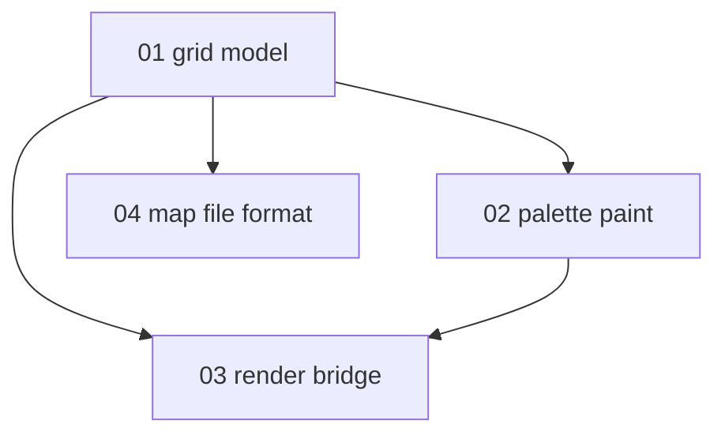

# Map editor specification — index and progress

Specs for the **paintable terrain grid** — UI and local map files. Consumes:

- [Game data loader](../game-data-loader/README.md) — terrain/furniture ids and names
- [Tileset loader](../tileset-loader/README.md) — sprites via `LoadedTileset`
- [Sprite viewer](../SPRITE_VIEWER.md) — reusable palette / draw patterns

**Not in scope:** walkable player simulation, BN save format, mapgen execution, multitile
neighbor autoconnect (v1 shows base tile sprite per cell).

**Status key:** `todo` · `draft` · `review` · `done`

---

## Project scope

### In scope (v1)

- 2D grid of terrain ids (optional furniture layer)
- Camera pan / zoom over grid
- Palette from `TerrainRegistry` (search/filter later)
- Click / drag paint with selected brush id
- Save / load nextgen map JSON ([04](./04-map-file-format.md))
- Render cells via `LoadedTileset` (fg/bg, animation — reuse viewer logic)

### Out of scope (v1)

| Topic | Notes |
| --- | --- |
| Player movement / collision | User deferred walkable demo |
| Z-levels | Single z=0 layer |
| Multitile edge autoconnect | BN draw-time logic; v2+ |
| BN `.sav2` import/export | Separate future spec |
| Furniture paint UI | v1 terrain layer only; furniture layer in file format |

---

## Where to implement

```text
core/src/main/java/io/gdx/cdda/bn/nextgen/
  gamedata/          # TerrainRegistry (see game-data-loader)
  view/
    MapEditorScreen.java      # unit 03 — orchestration
    MapPalettePanel.java    # unit 02 — brush picker
    TileSpriteResolver.java # shared with TileDisplayScreen (extract)
  map/
    MapGrid.java              # unit 01
    MapFileIO.java            # unit 04
```

---

## Unit map



---

## Progress

| Unit | File | Status | Depends on |
| --- | --- | --- | --- |
| 01 | [01-grid-model.md](./01-grid-model.md) | draft | game-data 08 |
| 02 | [02-palette-and-paint.md](./02-palette-and-paint.md) | draft | 01, game-data 08 |
| 03 | [03-render-bridge.md](./03-render-bridge.md) | draft | 01, tileset 08 |
| 04 | [04-map-file-format.md](./04-map-file-format.md) | draft | 01 |

---

## Suggested work phases

| Phase | Units | Goal |
| --- | --- | --- |
| 1 — Data | game-data 02–08 | `TerrainRegistry` populated |
| 2 — Grid | 01, 04 | In-memory map + save/load |
| 3 — Render | 03 | Draw grid with tileset |
| 4 — Edit | 02 | Palette + paint |

---

## Related

- [implementation-plan.md](./implementation-plan.md)
- [../GAME_DATA_LOADER.md](../GAME_DATA_LOADER.md)
- [../TILESET_LOADER.md](../TILESET_LOADER.md)

---

## Changelog

| Date | Change |
| --- | --- |
| 2026-06-15 | Initial index; split from game-data-loader appendix |
| 2026-06-15 | Deep-dive expansion on units 01–04 |
