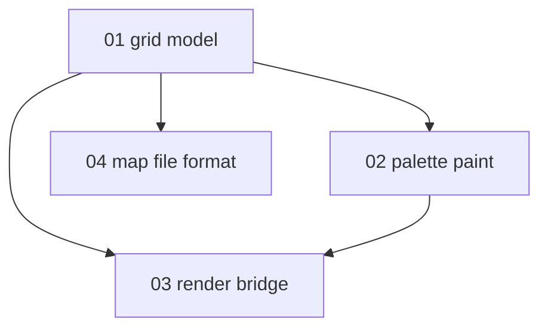

# Map editor specification — index and progress

Specs for the **paintable terrain grid** — UI and local map files. Consumes:

- [Game data loader](../game-data-loader/README.md) — terrain/furniture ids and names
- [Tileset loader](../tileset-loader/README.md) — sprites via `LoadedTileset`
- [Sprite viewer](../SPRITE_VIEWER.md) — reusable palette / draw patterns

**Not in scope:** walkable player simulation, BN save format, full world/overmap generation,
multitile neighbor autoconnect (v1 shows base tile sprite per cell). For JSON mapgen preview
see [mapgen-preview](../mapgen-preview/README.md).

**Status key:** `todo` · `draft` · `review` · `done`

---

## Project scope

### In scope (v1)

- 2D grid of terrain ids (optional furniture layer in file format)
- Camera pan / zoom over grid
- Palette from `TerrainRegistry` — **paintable-only** rows for active tileset
- Click / drag paint, eyedropper, bottom toolbar, mouse palette
- Text filter on palette (`/`)
- Save / load nextgen map JSON ([04](./04-map-file-format.md))
- Render cells via `LoadedTileset` (fg/bg, animation)
- `TilesetLoadSession` + spinner on tileset swap
- Boot from `MainMenuScreen` or sprite viewer `E`

### Out of scope (v1)

| Topic | Notes |
| --- | --- |
| Player movement / collision | Deferred |
| Z-levels | Single z=0 layer |
| Multitile edge autoconnect | BN draw-time logic; v2+ |
| BN `.sav2` import/export | Future |
| Furniture paint UI | Terrain layer only in UI |

---

## Where to implement

```text
core/src/main/java/io/gdx/cdda/bn/nextgen/
  gamedata/          # TerrainRegistry (see game-data-loader)
  view/
    MainMenuScreen.java
    MapEditorScreen.java
    MapEditorToolbar.java
    MapPalettePanel.java
    TileSpriteResolver.java
    ScreenInput.java
    LoadingSpinner.java
  map/
    MapGrid.java
    MapFileIO.java
```

---

## Unit map



---

## Progress

| Unit | File | Status | Depends on |
| --- | --- | --- | --- |
| 01 | [01-grid-model.md](./01-grid-model.md) | done | game-data 08 |
| 02 | [02-palette-and-paint.md](./02-palette-and-paint.md) | done | 01, game-data 08 |
| 03 | [03-render-bridge.md](./03-render-bridge.md) | done | 01, tileset 08 |
| 04 | [04-map-file-format.md](./04-map-file-format.md) | done | 01 |

---

## Work phases

| Phase | Units | PR | Status |
| --- | --- | --- | --- |
| 1 — Data | game-data G2 | — | done (terrain registry) |
| 2 — Grid | 01, 04 | M1 | done |
| 3 — Render | 03 | M2 | done |
| 4 — Edit | 02 | M3 | done |
| 5 — Polish | 02, 03 | M4 | done |

**PR slices (canonical):** [MAP_EDITOR.md](../MAP_EDITOR.md#suggested-pr-slices-map-editor).

---

## Related

- [implementation-plan.md](./implementation-plan.md)
- [../MAP_EDITOR.md](../MAP_EDITOR.md)
- [../GAME_DATA_LOADER.md](../GAME_DATA_LOADER.md)
- [../TILESET_LOADER.md](../TILESET_LOADER.md)

---

## Changelog

| Date | Change |
| --- | --- |
| 2026-06-15 | Initial index; split from game-data-loader appendix |
| 2026-06-15 | Deep-dive expansion on units 01–04 |
| 2026-06-16 | M1–M4 implemented; mouse, ScreenInput, paintable palette, tileset spinner |
