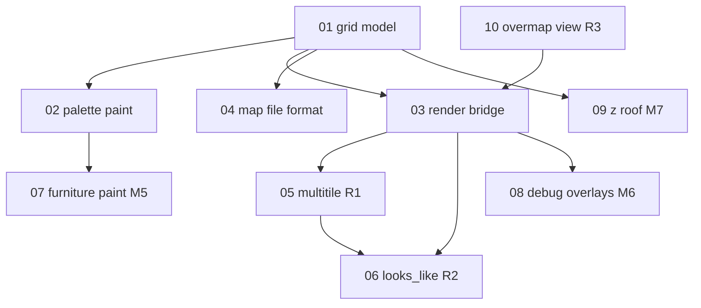

# Map editor specification — index and progress

Specs for the **paintable terrain grid** — UI and local map files. Consumes:

- [Game data loader](../game-data-loader/README.md) — terrain/furniture ids and names
- [Tileset loader](../tileset-loader/README.md) — sprites via `LoadedTileset`
- [Sprite viewer](../SPRITE_VIEWER.md) — reusable palette / draw patterns
- [Mapgen preview](../mapgen-preview/README.md) — import JSON mapgen → `MapGrid` / `MapVolume`

**Not in scope:** walkable player simulation, BN save format. Overmap generation lives in
[worldgen](../worldgen/README.md); the editor hosts overmap debug UI ([10](./10-overmap-debug-view.md))
and the main-menu **Worldgen** shortcut.

**Status key:** `todo` · `draft` · `review` · `done`

---

## Project scope

### In scope (v1 — done)

- 2D grid of terrain ids (+ furniture in file format / mapgen import)
- Camera pan / zoom over grid
- Palette from `TerrainRegistry` — **paintable-only** rows for active tileset
- Click / drag paint, eyedropper, bottom toolbar, mouse palette
- Text filter on palette (`/`)
- Save / load nextgen map JSON ([04](./04-map-file-format.md))
- Render cells via `LoadedTileset` (fg/bg, animation)
- Mapgen import picker, `MapVolume` multi-floor, furniture **display** toggle (`F`)
- Boot from `MainMenuScreen` (**Map Editor** or **Worldgen**) or sprite viewer `E`
- `TilesetLoadSession` + spinner on tileset swap; busy overlay deferred while tileset loads

### In scope (v2 — post–mapgen-v2)

| Topic | Unit | PR |
| --- | --- | --- |
| Terrain multitile autoconnect | [05](./05-multitile-autoconnect.md) | **R1** |
| `looks_like` draw fallback | [06](./06-looks-like-draw-fallback.md) | **R2** |
| Furniture paint brush | [07](./07-furniture-paint.md) | **M5** |
| Spawn marker debug overlay | [08](./08-debug-overlays.md) | **M6** |
| Z-level roof cutaway | [09](./09-z-roof-transparency.md) | **M7** — done |
| Overmap debug view | [10](./10-overmap-debug-view.md) | **R3** — done |

**Plan:** [v2-implementation-plan.md](./v2-implementation-plan.md)

### Out of scope

| Topic | Notes |
| --- | --- |
| Player movement / collision | Deferred |
| BN `.sav2` import/export | Future |
| Full BN lighting / visibility | Game client |
| Item sprites on ground | [G6+](../worldgen/10-game-data-g6-plus.md) |

---

## Where to implement

```text
core/src/main/java/io/gdx/cdda/bn/nextgen/
  gamedata/          # TerrainRegistry (see game-data-loader)
  view/
    MainMenuScreen.java
    MapEditorScreen.java
    MapEditorToolbar.java
    MapPalettePanel.java
    TileSpriteResolver.java
    ScreenInput.java
    LoadingSpinner.java
  map/
    MapGrid.java
    MapFileIO.java
```

---

## Unit map



---

## Progress

| Unit | File | Status | Depends on |
| --- | --- | --- | --- |
| 01 | [01-grid-model.md](./01-grid-model.md) | done | game-data 08 |
| 02 | [02-palette-and-paint.md](./02-palette-and-paint.md) | done | 01, game-data 08 |
| 03 | [03-render-bridge.md](./03-render-bridge.md) | done | 01, tileset 08 |
| 04 | [04-map-file-format.md](./04-map-file-format.md) | done | 01 |
| 05 | [05-multitile-autoconnect.md](./05-multitile-autoconnect.md) | done | 03, tileset 07b |
| 06 | [06-looks-like-draw-fallback.md](./06-looks-like-draw-fallback.md) | done | 03, 05, game-data G2 |
| 07 | [07-furniture-paint.md](./07-furniture-paint.md) | todo | 02, game-data G3 |
| 08 | [08-debug-overlays.md](./08-debug-overlays.md) | todo | 03, mapgen P13b |
| 09 | [09-z-roof-transparency.md](./09-z-roof-transparency.md) | done | 03, mapgen 11 |
| 10 | [10-overmap-debug-view.md](./10-overmap-debug-view.md) | done | worldgen W1–W2 |

---

## Work phases

| Phase | Units | PR | Status |
| --- | --- | --- | --- |
| 1 — Data | game-data G2 | — | done (terrain registry) |
| 2 — Grid | 01, 04 | M1 | done |
| 3 — Render | 03 | M2 | done |
| 4 — Edit | 02 | M3 | done |
| 5 — Polish | 02, 03 | M4 | done |
| 6 — Mapgen import | mapgen 06–11 | — | done (preview integration) |
| 7 — Draw parity | 05, 06 | R1, R2 | done |
| 8 — Edit v2 | 07, 08 | M5, M6 | todo |
| 9 — Overmap UI | 10 | R3 | todo (with W2) |

**v1 PR slices:** [MAP_EDITOR.md](../MAP_EDITOR.md#suggested-pr-slices-map-editor).  
**v2 PR slices:** [v2-implementation-plan.md](./v2-implementation-plan.md).

---

## Related

- [implementation-plan.md](./implementation-plan.md)
- [v2-implementation-plan.md](./v2-implementation-plan.md)
- [../MAP_EDITOR.md](../MAP_EDITOR.md)
- [../GAME_DATA_LOADER.md](../GAME_DATA_LOADER.md)
- [../TILESET_LOADER.md](../TILESET_LOADER.md)

---

## Changelog

| Date | Change |
| --- | --- |
| 2026-06-15 | Initial index; split from game-data-loader appendix |
| 2026-06-15 | Deep-dive expansion on units 01–04 |
| 2026-06-17 | v2 units 05–10; R1–R3 + M5–M7 plan; mapgen import notes |
