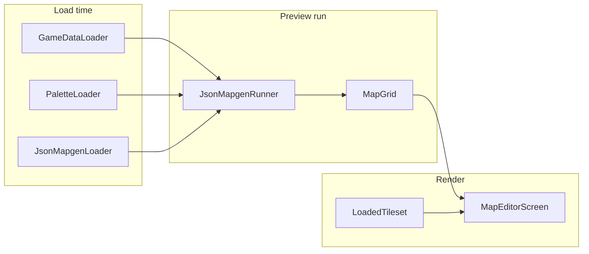

# 01 — Overview and scope

What **mapgen preview** is, how it differs from BN full world generation, coordinate systems,
and where it sits in the nextgen roadmap.

---

## Purpose

Run a **single BN JSON mapgen** (`method: json`) into a [`MapGrid`](../map-editor/01-grid-model.md)
and display it in the map editor. Gives a visual slice of real BN buildings without porting
overmap generation, submap buffers, or simulation.

**User-facing goal:** pick a house (or search by `om_terrain` id) → see walls, floors, and
furniture on screen.

---

## Coordinate systems

| Space | BN | Nextgen preview |
| --- | --- | --- |
| Submap | 24×24 cells (`SEEX`×`SEEY`), z-level stack | Single 2D `MapGrid`; one z per preview run |
| Row index | `y` increases downward in `rows` array | Same — row 0 = top of grid ([map editor 01](../map-editor/01-grid-model.md)) |
| OMT | 24 submaps per overmap terrain tile | Not modeled |
| Rotation | OMT / mapgen `rotation` may rotate submap | **Deferred** — preview shows unrotated JSON |

BN `mapf::formatted_set_simple` walks a string left-to-right, then `\n` advances `y`. JSON
`rows` uses one string per row instead of embedded newlines — same result.

---

## BN world generation (reference — out of scope here)

```text
World creation
  → dependency_tree.resolve(user_mod_selection)
  → normalize_mod_load_order (core first)
  → load_and_finalize_packs → all JSON including mapgen + palettes
  → overmap::generate (rivers, cities, specials)
  → overmap_terrain id per OMT cell

Player approaches OMT / submap loads
  → map::draw_map(dat)
  → pick weighted mapgen_function for om_terrain + z
  → mapgen_function_json::generate(mapgendata)
       1. draw_fill_background(fill_ter)
       2. predecessor_mapgen (optional)
       3. jmapgen_objects.apply (rows-derived + place_*)
       4. resolve_regional_terrain_and_furniture
       5. rotate per OMT / mapgen rotation
  → submap cached in mapbuffer
```

| Layer | BN sources | Nextgen v1 |
| --- | --- | --- |
| Overmap gen | `src/overmap.cpp`, `src/overmapbuffer.cpp` | **Out of scope** |
| `overmap_terrain` | `data/json/overmap_terrain/` | **Catalog index only** |
| Mapgen registry | `src/mapgen.cpp` — `oter_mapgen`, `load_mapgen` | Load defs; no weighted pick |
| JSON mapgen | `mapgen_function_json` | **In scope** — rows → grid |
| Palettes | `mapgen_palette` in `src/mapgen.cpp` | **In scope** — subset |
| Regional tokens | `t_region_groundcover_*` resolved at run | **Warn + pass through id** (may lack gfx) |
| Nested / update mapgen | `nested_mapgen`, `update_mapgen` | **Deferred** |
| Lua mapgen | `mapgen_function_lua` | **Deferred** |
| `place_*` spawning | items, monsters, vehicles | **Deferred** |

---

## Nextgen mapgen preview pipeline (v1)

```text
Startup / editor open
  GameDataLoader.loadMods(…)           → TerrainRegistry, FurnitureRegistry
  PaletteLoader.load(scanOptions)      → PaletteRegistry
  JsonMapgenLoader.scan(…)             → MapgenCatalog (lazy ok)

User picks JsonMapgenDefinition
  JsonMapgenRunner.run(def, palettes)  → MapGrid
  MapEditorScreen.setGrid(grid)
  TilesetLoadSession + drawGrid        → terrain (P4: + furniture)
  GameDataValidator (optional gfx)     → HUD warning count
```

No overmap, no z-stack merge, no BN `.sav2` submap format.



---

## In scope (v1 milestones P1–P4)

| Milestone | Deliverable | Unit |
| --- | --- | --- |
| **P1** | Scan palettes; `PaletteRegistry`; char resolution | [03](./03-palette-loader.md) |
| **P2** | Parse json mapgen; `JsonMapgenRunner` | [04](./04-json-mapgen-format.md), [05](./05-rows-runner.md) |
| **P3** | Catalog + import UI | [06](./06-preview-ui.md) |
| **P4** | Furniture sprites on canvas | [07](./07-furniture-render.md) |

### v1 palette / row semantics (pragmatic subset)

| BN feature | v1 policy |
| --- | --- |
| `terrain` / `furniture` char maps | Required for symbols used in `rows` |
| Weighted arrays `[[id, weight], …]` | **First** entry (deterministic); log at FINE |
| `parameters` / `{ "param": "…", "fallback": "…" }` | Use **`fallback`** only |
| Palette `palettes: [ "other" ]` inheritance | **Deferred** — load flat ids from `mapgen_palettes/` only |
| `t_region_*` terrain tokens | Store literal id; regional resolve deferred |
| `items`, `liquids`, `toilets`, `vehicles`, … | Ignore |
| `place_monsters`, `place_npcs`, `set`, `nested` | Ignore |

### v1 mapgen `object` fields

| Field | v1 |
| --- | --- |
| `fill_ter` | Yes — full-grid background before rows |
| `rows` | Yes |
| `palettes` | Yes — merge in array order |
| `terrain`, `furniture` | Yes — per-char overrides (same as inline palette) |
| Everything under `place_*` | No |

---

## Out of scope (v1)

- Overmap and procedural world layout
- Multi-z preview in one grid (run `house_09` and `house_09_roof` as two previews)
- `method: builtin` / `method: lua`
- Randomized palette weights and `mapgen_parameter` rolls
- `predecessor_mapgen`, explicit `rotation`
- Multitile terrain autoconnect at draw time
- BN `mapbuffer` / submap save format

---

## v2 parity roadmap (summary)

Full detail: [08-v2-parity-roadmap.md](./08-v2-parity-roadmap.md).

| Feature | Priority |
| --- | --- |
| Palette `palettes` inheritance + weighted picks | High |
| `place_terrain` / `place_furniture` rectangles | Medium |
| Nested mapgen (`nested` key) | Medium |
| Regional terrain resolve | Medium (needs region data) |
| Rotation preview | Low |
| Overmap + visit-tile mapgen pick | Separate project |

---

## Dependencies (already in repo)

| Upstream | Provides |
| --- | --- |
| [Game data loader](../game-data-loader/README.md) G1–G5 | `loadMods`, registries, mod order |
| [Map editor](../map-editor/README.md) M1–M4 | `MapGrid`, `MapEditorScreen`, `TileSpriteResolver` |
| [Tileset loader](../tileset-loader/README.md) | `LoadedTileset`, `TilesetLoadSession` |

**Recommended game-data scan for preview:** extend `GameDataLoadOptions` or use separate
`MapgenScanOptions` with full `json/` roots — palettes live outside `furniture_and_terrain/`.

---

## Package layout (planned)

```text
core/src/main/java/io/gdx/cdda/bn/nextgen/
  mapgen/
    MapgenScanOptions.java
    MapgenLoadResult.java         # palettes + warnings
    palette/
      MapgenPalette.java
      PaletteRegistry.java
      PaletteLoader.java
      PaletteCharResolver.java    # weighted / param / string
    json/
      JsonMapgenDefinition.java
      JsonMapgenLoader.java
      JsonMapgenRunner.java
      RowsInterpreter.java
      MergedCharMap.java          # terrain + furniture per char
    preview/
      MapgenCatalog.java
      MapgenPreviewService.java   # orchestrates load + run
  view/
    MapEditorScreen.java          # P3 import, P4 furniture draw
    MapgenPickerDialog.java       # optional P3
```

Package root: `io.gdx.cdda.bn.nextgen.mapgen`

---

## BN source reference

| Concern | Location |
| --- | --- |
| Mapgen JSON load | `src/mapgen.cpp` — `load_mapgen`, `load_mapgen_function` |
| `setup_common` (rows) | `src/mapgen.cpp` — `mapgen_function_json_base::setup_common` |
| JSON generate | `src/mapgen.cpp` — `mapgen_function_json::generate` |
| Row apply | `src/mapgenformat.cpp` — `formatted_set_simple` |
| Palettes | `src/mapgen.cpp` — `mapgen_palette::load_internal`, `add` |
| Example mapgen | `data/json/mapgen/house/house09.json` |
| Example palette | `data/json/mapgen_palettes/house_general_palette.json` |
| Author docs | `docs/en/mod/json/reference/mapgen.md` (Cataclysm-BN repo) |

---

## Verification

1. Document separates preview from full worldgen with coordinate table
2. P1–P4 map to units 02–07
3. Agent can implement P1 without importing `overmap.h`
4. v2 items listed in unit 08 without blocking v1
