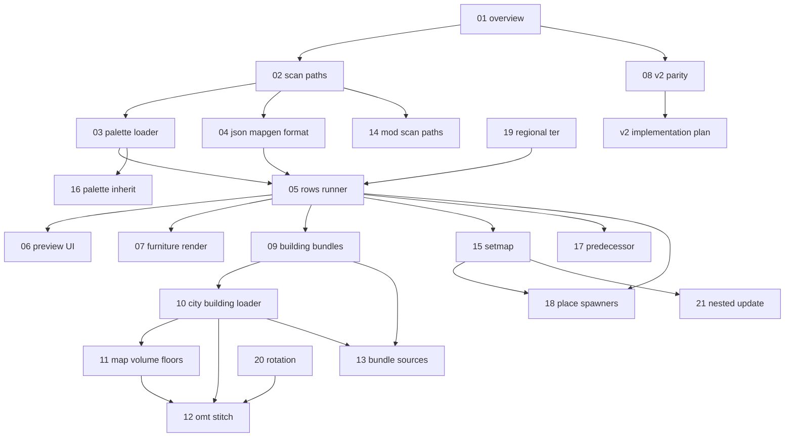

# Mapgen preview specification — index and progress

Specs for **BN JSON mapgen → MapGrid preview** — a visual slice of building generation
without full world/overmap simulation.

**Implementing in this repo?** Start with
[implementation-plan.md](./implementation-plan.md) and [MAPGEN_PREVIEW.md](../MAPGEN_PREVIEW.md).

**Status key:** `todo` · `draft` · `review` · `done`

---

## Consumes

- [Game data loader](../game-data-loader/README.md) — terrain/furniture ids (G1–G5 done)
- [Map editor](../map-editor/README.md) — `MapGrid`, render bridge (M1–M4 done)
- [Tileset loader](../tileset-loader/README.md) — sprites

**Not in scope (mapgen preview):** full overmap generation — see [WORLDGEN.md](../WORLDGEN.md); `method: builtin` / `lua` at world scale; BN `.sav2`.

---

## Project scope

### In scope (v1 — P1–P4)

- Scan `mapgen_palettes/` and `mapgen/` JSON per mod order
- `PaletteRegistry` with deterministic char → id resolution
- `JsonMapgenRunner`: `fill_ter`, `rows`, palette merge, inline overrides
- `MapgenCatalog` + editor import UI
- Furniture sprites on map editor canvas

### In scope (v1.5 — P5–P7 building bundles)

- `city_building` metadata from `multitile_city_buildings.json`
- `overmap_special` vertical stacks (e.g. `2farm_6` floors)
- `MapVolume` — one grid per z-level, floor switch in editor
- OMT stitch — multi-tile same floor into one canvas ([09](./09-building-bundles-overview.md))
- Bundle source inventory — [13](./13-building-bundle-sources.md)
- Whole static specials — [13](./13-building-bundle-sources.md) P7c

### In scope (v2 — runner parity)

- Mod scan paths — [14](./14-mod-scan-paths.md) (**P8 done**)
- `set` array — [15](./15-setmap-applier.md) (**P9 next**)
- Palette inheritance + weighted chars — [16](./16-palette-inheritance.md)
- `predecessor_mapgen` — [17](./17-predecessor-mapgen.md)
- `place_*` spawners — [18](./18-place-spawners.md)
- Regional `t_region_*` — [19](./19-regional-terrain.md)
- Rotation — [20](./20-mapgen-rotation.md)
- Nested / update mapgen — [21](./21-nested-update-mapgen.md)

**Plan:** [v2-implementation-plan.md](./v2-implementation-plan.md)

### Out of scope (v1)

| Topic | See |
| --- | --- |
| Full world generation | [01](./01-overview-and-scope.md), [worldgen/](../worldgen/README.md) |
| Weighted `oter_mapgen` pick | [08](./08-v2-parity-roadmap.md) |
| `method: builtin` / `lua` | [08](./08-v2-parity-roadmap.md) |
| Furniture paint brush | Map editor v2 |

### Primary BN sources

| Area | Files |
| --- | --- |
| Mapgen load / run | `src/mapgen.cpp` |
| Row formatting | `src/mapgenformat.cpp` |
| Palettes | `src/mapgen.cpp` — `mapgen_palette` |
| Data | `data/json/mapgen/`, `data/json/mapgen_palettes/` |
| City buildings | `data/json/overmap/multitile_city_buildings.json` |
| Special stacks | `data/json/overmap/overmap_special/`, `overmap_mutable/` |
| Bundle inventory | [13-building-bundle-sources.md](./13-building-bundle-sources.md) |
| Author docs | `docs/en/mod/json/reference/mapgen.md` |

---

## Unit map

---

## Progress

| Unit | File | Status | Summary |
| --- | --- | --- | --- |
| 01 | [01-overview-and-scope.md](./01-overview-and-scope.md) | draft | Preview vs worldgen; coordinates; pipeline |
| 02 | [02-scan-paths.md](./02-scan-paths.md) | done | Scan dirs incl. `overmap_and_mapgen/` (P8) |
| 03 | [03-palette-loader.md](./03-palette-loader.md) | draft | `type: palette`, merge, char resolver |
| 04 | [04-json-mapgen-format.md](./04-json-mapgen-format.md) | draft | `type: mapgen`, `object` fields |
| 05 | [05-rows-runner.md](./05-rows-runner.md) | draft | `JsonMapgenRunner` algorithm |
| 06 | [06-preview-ui.md](./06-preview-ui.md) | draft | Picker, service, editor hook |
| 07 | [07-furniture-render.md](./07-furniture-render.md) | done | Furniture draw layer |
| 08 | [08-v2-parity-roadmap.md](./08-v2-parity-roadmap.md) | draft | Deferred BN parity index |
| 09 | [09-building-bundles-overview.md](./09-building-bundles-overview.md) | done | Multi-floor + multi-OMT scope |
| 10 | [10-city-building-loader.md](./10-city-building-loader.md) | done | `city_building` scan + resolver |
| 11 | [11-map-volume-and-floors.md](./11-map-volume-and-floors.md) | done | `MapVolume`, floor UI (P5) |
| 12 | [12-omt-stitch-composer.md](./12-omt-stitch-composer.md) | done | Stitch OMT pieces (P6) |
| 13 | [13-building-bundle-sources.md](./13-building-bundle-sources.md) | done | BN bundle types; P7 done |
| 14 | [14-mod-scan-paths.md](./14-mod-scan-paths.md) | done | `overmap_and_mapgen/` scan (P8) |
| 15 | [15-setmap-applier.md](./15-setmap-applier.md) | todo | `object.set` array (P9) |
| 16 | [16-palette-inheritance.md](./16-palette-inheritance.md) | todo | Parent palettes, weighted chars (P10) |
| 17 | [17-predecessor-mapgen.md](./17-predecessor-mapgen.md) | todo | Outdoor underlay (P12) |
| 18 | [18-place-spawners.md](./18-place-spawners.md) | todo | `place_*` rectangles (P13) |
| 19 | [19-regional-terrain.md](./19-regional-terrain.md) | todo | `t_region_*` resolve (P11) |
| 20 | [20-mapgen-rotation.md](./20-mapgen-rotation.md) | todo | Submap rotation (P14) |
| 21 | [21-nested-update-mapgen.md](./21-nested-update-mapgen.md) | todo | Nested + update mapgen (P15) |
| — | [v2-implementation-plan.md](./v2-implementation-plan.md) | draft | v2 PR slices P8–P15 |

---

## Work phases

| Phase | Units | PR | Status |
| --- | --- | --- | --- |
| 1 — Palettes | 02, 03 | **P1** | done |
| 2 — Runner | 04, 05 | **P2** | done |
| 3 — UI | 06 | **P3** | done |
| 4 — Furniture draw | 07 | **P4** | done |
| 5 — Building floors | 09, 10, 11 | **P5** | done |
| 6 — OMT stitch | 12 | **P6** | done |
| 7 — Bundle discovery | 13 | **P7** | done |
| 8 — v2 runner parity | 14–21 | **P8–P15** | P8 done; P9 next |

**v1 plan:** [implementation-plan.md](./implementation-plan.md)  
**v2 plan:** [v2-implementation-plan.md](./v2-implementation-plan.md)

---

## Unit doc conventions

Each unit includes:

1. **Purpose** — what the component does
2. **Algorithms** — pseudocode aligned with BN where applicable
3. **Planned Java types** — class names and fields
4. **BN source reference** — C++ anchors
5. **Inputs / outputs / failure modes**
6. **Verification** — checklist for tests

---

## Related

- [implementation-plan.md](./implementation-plan.md) — v1
- [v2-implementation-plan.md](./v2-implementation-plan.md) — v2
- [../MAPGEN_PREVIEW.md](../MAPGEN_PREVIEW.md)
- [../MAP_EDITOR.md](../MAP_EDITOR.md)
- [../GAME_DATA_LOADER.md](../GAME_DATA_LOADER.md)

---

## Changelog

| Date | Change |
| --- | --- |
| 2026-06-16 | Initial spec tree (units 01–07) |
| 2026-06-16 | Expanded all units; added 08 v2 parity roadmap |
| 2026-06-16 | Added 09–12 building bundles (P5 floor switch, P6 OMT stitch) |
| 2026-06-17 | Added 13 building bundle sources inventory (P7 gaps) |
| 2026-06-17 | P7a `BuildingBundleScanner` — full mod JSON bundle discovery |
| 2026-06-17 | v2 units 14–21 + `v2-implementation-plan.md`; P8 mod scan paths done |
| 2026-06-17 | Expanded v2 unit docs: BN pipeline order, schemas, fixtures, BN C++ refs |
