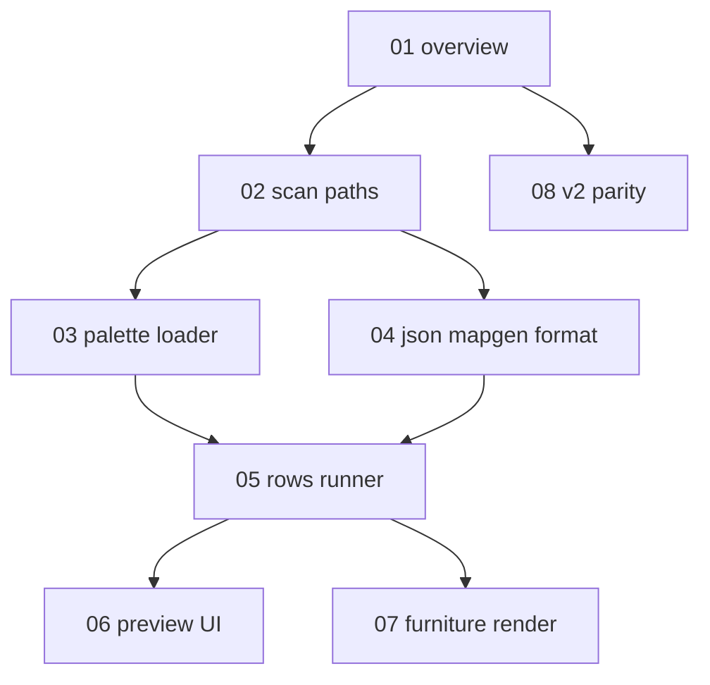

# Mapgen preview specification — index and progress

Specs for **BN JSON mapgen → MapGrid preview** — a visual slice of building generation
without full world/overmap simulation.

**Implementing in this repo?** Start with
[implementation-plan.md](./implementation-plan.md) and [MAPGEN_PREVIEW.md](../MAPGEN_PREVIEW.md).

**Status key:** `todo` · `draft` · `review` · `done`

---

## Consumes

- [Game data loader](../game-data-loader/README.md) — terrain/furniture ids (G1–G5 done)
- [Map editor](../map-editor/README.md) — `MapGrid`, render bridge (M1–M4 done)
- [Tileset loader](../tileset-loader/README.md) — sprites

**Not in scope:** overmap generation, `method: builtin` / `lua`, nested mapgen, BN `.sav2`.

---

## Project scope

### In scope (v1 — P1–P4)

- Scan `mapgen_palettes/` and `mapgen/` JSON per mod order
- `PaletteRegistry` with deterministic char → id resolution
- `JsonMapgenRunner`: `fill_ter`, `rows`, palette merge, inline overrides
- `MapgenCatalog` + editor import UI
- Furniture sprites on map editor canvas

### Out of scope (v1)

| Topic | See |
| --- | --- |
| Full world generation | [01](./01-overview-and-scope.md) |
| Weighted random palettes | [08](./08-v2-parity-roadmap.md) |
| `place_items`, monsters, vehicles | [08](./08-v2-parity-roadmap.md) |
| Furniture paint brush | Map editor v2 |

### Primary BN sources

| Area | Files |
| --- | --- |
| Mapgen load / run | `src/mapgen.cpp` |
| Row formatting | `src/mapgenformat.cpp` |
| Palettes | `src/mapgen.cpp` — `mapgen_palette` |
| Data | `data/json/mapgen/`, `data/json/mapgen_palettes/` |
| Author docs | `docs/en/mod/json/reference/mapgen.md` |

---

## Unit map

---

## Progress

| Unit | File | Status | Summary |
| --- | --- | --- | --- |
| 01 | [01-overview-and-scope.md](./01-overview-and-scope.md) | draft | Preview vs worldgen; coordinates; pipeline |
| 02 | [02-scan-paths.md](./02-scan-paths.md) | draft | Scan dirs, catalog, mod order |
| 03 | [03-palette-loader.md](./03-palette-loader.md) | draft | `type: palette`, merge, char resolver |
| 04 | [04-json-mapgen-format.md](./04-json-mapgen-format.md) | draft | `type: mapgen`, `object` fields |
| 05 | [05-rows-runner.md](./05-rows-runner.md) | draft | `JsonMapgenRunner` algorithm |
| 06 | [06-preview-ui.md](./06-preview-ui.md) | draft | Picker, service, editor hook |
| 07 | [07-furniture-render.md](./07-furniture-render.md) | draft | Furniture draw layer |
| 08 | [08-v2-parity-roadmap.md](./08-v2-parity-roadmap.md) | draft | Deferred BN parity |

---

## Work phases

| Phase | Units | PR | Status |
| --- | --- | --- | --- |
| 1 — Palettes | 02, 03 | **P1** | done |
| 2 — Runner | 04, 05 | **P2** | done |
| 3 — UI | 06 | **P3** | done |
| 4 — Furniture draw | 07 | **P4** | todo |

**PR slices:** [MAPGEN_PREVIEW.md](../MAPGEN_PREVIEW.md#suggested-pr-slices)

---

## Unit doc conventions

Each unit includes:

1. **Purpose** — what the component does
2. **Algorithms** — pseudocode aligned with BN where applicable
3. **Planned Java types** — class names and fields
4. **BN source reference** — C++ anchors
5. **Inputs / outputs / failure modes**
6. **Verification** — checklist for tests

---

## Related

- [implementation-plan.md](./implementation-plan.md)
- [../MAPGEN_PREVIEW.md](../MAPGEN_PREVIEW.md)
- [../MAP_EDITOR.md](../MAP_EDITOR.md)
- [../GAME_DATA_LOADER.md](../GAME_DATA_LOADER.md)

---

## Changelog

| Date | Change |
| --- | --- |
| 2026-06-16 | Initial spec tree (units 01–07) |
| 2026-06-16 | Expanded all units; added 08 v2 parity roadmap |
