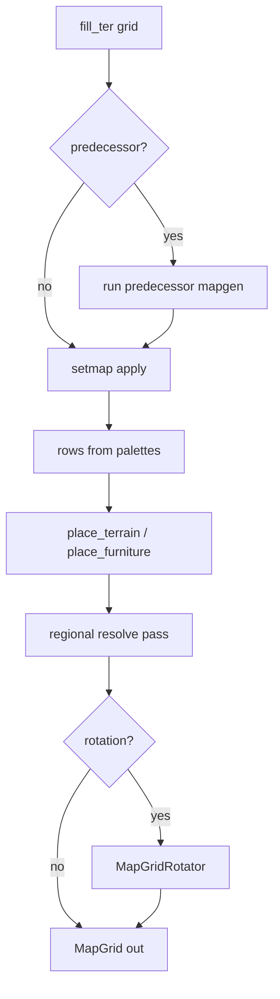

# Implementation plan — mapgen preview v2

Agent-oriented guide for **BN mapgen runner parity** after v1 (P1–P7c). Unit specs: [README](./README.md) units 14–21; index [08](./08-v2-parity-roadmap.md).

---

## Goal

Make imported buildings **look like BN** for common json mapgen — not full worldgen. v2 extends
`JsonMapgenRunner` and palette loading; bundle composition (P5–P7c) stays as-is unless a feature
requires stitch changes.

**First success criterion:** Arcana `arcana_anomaly_resurgence` buffer ring shows resin walls /
barren ground from `set` (not empty grass rows only).

**Second success criterion:** `house09` ground `fill_ter` and palette chars using `t_region_*`
resolve to drawable terrain ids for the default region.

---

## v2 runner pipeline (target)

BN `mapgen_function_json::generate` order — nextgen should converge on this inside
`JsonMapgenRunner.run`:

```text
1. draw_fill_background(fill_ter)           // v1 ✓
2. predecessor_mapgen (full submap)           // P12 — [17]
3. setmap_points.apply                      // P9  — [15]
4. jmapgen_objects.apply                    // rows (v1 ✓) + place_* (P13 — [18])
5. resolve_regional_terrain_and_furniture   // P11 — [19]
6. rotate(mapgen.rotation + OMT rotation)   // P14 — [20]
```

Nested mapgen runs as part of step 4 (`mapgen_phase::nested_mapgen`). Update mapgen is a
separate catalog entry type (P15 — [21]).



---

## Dependencies

| Upstream | Provides |
| --- | --- |
| v1 P1–P7c | `JsonMapgenRunner`, `MapVolumeBuilder`, scanners |
| [Game data G1–G5](../game-data-loader/implementation-plan.md) | Terrain/furniture registries |
| [14-mod-scan-paths](./14-mod-scan-paths.md) | `overmap_and_mapgen/` scan — **done** |

Optional later:

| Upstream | Enables |
| --- | --- |
| Game data G6+ items | `place_items` preview markers ([18](./18-place-spawners.md) P13b) |
| Game data monsters | `place_monsters` density hints |
| `region_settings` loader | Full `t_region_*` table ([19](./19-regional-terrain.md)) |

### PR dependency graph

```text
P8 (done) ─┬─► P9 setmap
           ├─► P10 palettes (parallel with P9)
           └─► P11 regional (needs resolved ids on cells)

P9 ──► P13 place_* (same objects pass as BN)
P10 ──► all runner PRs (better char maps)
P12 predecessor ──► P14 rotation (shared unrotate/rotate)
P9 + rows ──► P15 nested (nested chunks are jmapgen pieces)
```

---

## Deliverables by PR

### P8 — Mod scan paths — **done**

| Class | Responsibility |
| --- | --- |
| `MapgenScanRoots` | `mapgen/` + `overmap_and_mapgen/` |
| `JsonMapgenLoader` | Scan both trees per mod |
| `PaletteLoader` | `mapgen_palettes/` + `overmap_and_mapgen/` |

**Spec:** [14](./14-mod-scan-paths.md)  
**Tests:** `AltMapgenLayoutScanTest`  
**Touches:** `JsonMapgenLoader.java`, `PaletteLoader.java`, `MapgenScanRoots.java`

---

### P9 — `set` array — **next**

| Class | Responsibility |
| --- | --- |
| `SetmapEntry` | Parsed point/line/square + op |
| `SetmapApplier` | Apply `object.set[]` on `MapGrid` |
| `JmapgenIntRange` | Parse `x`/`y` int or `[min,max]` with seeded roll |
| `JsonMapgenRunner` | Invoke setmap **before** rows (BN order) |

**Spec:** [15](./15-setmap-applier.md)

**Fixture:** `mapgen-fixtures/json/mapgen/test_setmap_buffer.json`

**Tests:**

- `SetmapApplierTest` — point + square ter, fixed seed repeat count
- Integration: Arcana `arcana_field_anomalous_buffer` (`@EnabledIf` Arcana mod)

**Manual:** Import `arcana_anomaly_resurgence` z=0 — buffer ring not uniform `fill_ter`.

---

### P10 — Palette inheritance

| Class | Responsibility |
| --- | --- |
| `PaletteResolver` | `resolveWithParents(id)` with cycle detection |
| `PaletteCharResolver` | Weighted arrays via `previewSeed` |
| `PaletteRegistry.merge` | Expand parents before char merge |
| `JsonMapgenRunOptions` | `long previewSeed` |

**Spec:** [16](./16-palette-inheritance.md)

**Fixture:**

```text
mapgen-fixtures/json/mapgen_palettes/parent_palette.json
mapgen-fixtures/json/mapgen_palettes/child_palette.json   # palettes: [parent], overrides #
```

**Tests:** `PaletteInheritanceTest`, `WeightedPaletteCharTest`

---

### P11 — Regional terrain

| Class | Responsibility |
| --- | --- |
| `RegionContext` | Load `region_settings` / `default` mappings |
| `RegionalTerrainResolver` | Post-pass on `MapGrid` cells |
| `JsonMapgenRunOptions` | `String previewRegionId` |

**Spec:** [19](./19-regional-terrain.md)

**Fixture:** `test_region_fill.json` with `fill_ter: t_region_groundcover`

**Tests:** `RegionalTerrainResolverTest`; optional BN `region_settings.json` integration

---

### P12 — `predecessor_mapgen`

| Class | Responsibility |
| --- | --- |
| `PredecessorMapgenRunner` | Recursive catalog lookup + full generate on same canvas |
| `JsonMapgenRunner` | Branch at start of `run` |

**Spec:** [17](./17-predecessor-mapgen.md)

**Fixture:** `test_predecessor_field.json` — outdoor field + small building rows

**Tests:** `PredecessorMapgenRunnerTest`

**Note:** Full rotation undo with predecessor deferred to P14; v2.0 may run predecessor without
rotate correction (document limitation).

---

### P13 — `place_*` spawners

| Phase | Scope |
| --- | --- |
| **P13** | `place_terrain`, `place_furniture` |
| **P13b** | `place_items`, `place_monsters`, `place_vehicles`, `place_npcs` |

| Class | Responsibility |
| --- | --- |
| `PlaceSpawnerApplier` | Rect + chance + repeat (shared `JmapgenIntRange`) |
| `SpawnMarker` | P13b metadata for editor overlay |

**Spec:** [18](./18-place-spawners.md)

**Fixture:** `test_place_furniture.json`

---

### P14 — Rotation

| Class | Responsibility |
| --- | --- |
| `MapGridRotator` | Quarter-turn ter/furn copy |
| `JsonMapgenRunner` | Final pass; predecessor unrotate in P12 |

**Spec:** [20](./20-mapgen-rotation.md)

**Fixture:** `test_rotation_asymmetric.json`

---

### P15 — Nested / update mapgen

| Class | Responsibility |
| --- | --- |
| `NestedMapgenRunner` | `nested` array + `mapgensize` |
| `UpdateMapgenApplier` | Second-pass merge |

**Spec:** [21](./21-nested-update-mapgen.md)

---

## `JsonMapgenRunOptions` (v2 fields)

| Field | Type | Default | Used by |
| --- | --- | --- | --- |
| `defaultFillTer` | String | `t_dirt` | v1 |
| `previewSeed` | long | `0xC0DA` | P9–P13 weighted rolls |
| `previewRegionId` | String | `"default"` | P11 |
| `omtRotation` | int 0–3 | `0` | P14 (from piece suffix or context) |
| `validateIds` | boolean | false | v1 |
| `warnings` | List | mutable | all |

Pass the **same** `JsonMapgenRunOptions` instance through `MapVolumeBuilder` / stitch so one
building import uses one seed (deterministic multi-floor).

---

## PR checklist

| PR | Compile | Unit tests | Manual smoke |
| --- | --- | --- | --- |
| P8 | ✓ | `AltMapgenLayoutScanTest` ✓ | Arcana specials in picker |
| P9 | | `SetmapApplierTest` | Arcana buffer ring |
| P10 | | `PaletteInheritanceTest` | `arcana_palette` chars |
| P11 | | `RegionalTerrainResolverTest` | Arcana `4` outdoor char |
| P12 | | `PredecessorMapgenRunnerTest` | house + field edge |
| P13 | | `PlaceSpawnerApplierTest` | — |
| P14 | | `MapGridRotatorTest` | rotated crop piece |
| P15 | | `NestedMapgenRunnerTest` | lab chunk |

Each PR: `gradlew.bat compileJava` && `gradlew.bat :core:test`

---

## v2 simplifications (do not expand mid-PR)

| Topic | v2.0 choice |
| --- | --- |
| RNG | Seeded `Random(previewSeed)` per mapgen run; not BN global rng |
| `set` chance | BN `one_in(chance)` — `chance: 1` = always; higher = rarer |
| `set` repeat | `repeat.get()` rolls per entry; each iteration re-rolls `x`/`y` ranges |
| Traps / radiation / bash in `set` | Warn-only or `MapCell` extension; no render v2.0 |
| `line` / `square` setmap | P9.1 if point-only ships first; spec [15](./15-setmap-applier.md) lists all |
| `method: builtin` / `lua` | Out of scope |
| Weighted `oter_mapgen` pick | Picker still lists all; no random variant |

---

## Agent entry point

1. Read [MAPGEN_PREVIEW.md](../MAPGEN_PREVIEW.md) v2 section
2. Read the **unit doc** for the PR (14–21)
3. Implement **one PR** — update `JsonMapgenRunner` pipeline in order above
4. Add fixture under `core/src/test/resources/mapgen-fixtures/`
5. Do not mix bundle (P5–P7) changes unless stitch needs rotation per-piece

---

## Related

- [08-v2-parity-roadmap.md](./08-v2-parity-roadmap.md)
- [implementation-plan.md](./implementation-plan.md) — v1
- [05-rows-runner.md](./05-rows-runner.md) — current runner
