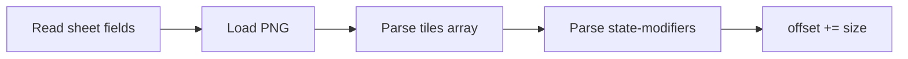

# 05 — Load pipeline

End-to-end orchestration from a selected tileset id to a loaded in-memory tileset. This
document ties together units 01–04 and points to 06–09 for sub-algorithms.

**Sprites-only port note:** Steps involving `ascii` and empty-ASCII-fallback sheet skips can
be omitted or treated as errors (units 04d/07c skipped).

---

## Entry points

| Caller | `precheck` | `force` | `mod_list` | Report |
| --- | --- | --- | --- | --- |
| SDL init | `true` | `false` | empty | no |
| `load_tileset()` at finalize | `false` | `false` | active world mods | yes |
| Option refresh | `false` | conditional | in-game mods or empty | yes (log) |
| Manual reload | `false` | `true` | in-game mods or empty | yes (callback) |

See [01](./01-overview-and-lifecycle.md) for when each runs.

Top-level BN function `load_tileset()` (finalize only):

```text
if not tilecontext or not use_tiles: return

load main context (TILES option, full load)
run loading report on main context

if OVERMAP_TILES == TILES:
    overmap context = shared pointer to main
else:
    create/load separate overmap context
    run loading report on overmap
```

---

## Layer 1 — Context wrapper (`load_tileset` on tile context)

```text
load_tileset(tileset_id, mod_list, precheck, force, pump_events):

    // Cache gate (unit 01)
    if not force
       and tileset already loaded
       and not FORCE_TILESET_RELOAD option
       and same tileset_id
       and same mod_list stamp:
        return

    clear tileset_mutation_overlay_ordering

    new_tileset = empty tileset
    loader = tileset_loader(new_tileset, renderer)
    loader.load(tileset_id, precheck, pump_events)   // may throw

    tileset_ptr = new_tileset                         // atomic swap on success
    tileset_mod_list_stamp = mod_list

    reset draw scale; configure minimap from tile_iso
```

On throw, previous `tileset_ptr` is unchanged.

---

## Layer 2 — Loader main (`tileset_loader::load`)

### Phase A — Resolve paths

```text
load(tileset_id, precheck, pump_events):

    if tileset_id in TILESETS:
        tileset_root = TILESETS[tileset_id]
        parse tileset.txt → json_conf, tileset_path
    else:
        log invalid id
        json_conf = "tile_config.json"
        tileset_path = "tinytile.png"
        tileset_root = ""

    json_path = tileset_root + "/" + json_conf
    img_path  = tileset_root + "/" + tileset_path

    open json_path or throw
    config = parse JSON object
```

Unit [04a](./04a-tileset-manifest.md).

### Phase B — `tile_info`

```text
require config.tile_info
for each entry in tile_info:
    set ts.tile_width, ts.tile_height, tile_iso, ts.tile_pixelscale
    (BN forces zlevel_height=0, retract_dist_* defaults)

if precheck:
    allow_omitted_members on config
    return                                    // stop here
```

Unit [04b](./04b-tile-config-structure.md).

### Phase C — Base config body

```text
[optional] init dynamic atlas batch

offset = 0
load_internal(config, tileset_root, img_path, pump_events)
```

### Phase D — Mod tilesets

```text
for mts in all_mod_tilesets in registration order:
    if not mts.compatible(tileset_id): continue

    sprite_id_offset = offset
    mod_root = mts.base_path
    open mts.full_path

  if JSON root is array:
      find object where type==mod_tileset and index==mts.num_in_file
      load_internal(that object, mod_root, img_path, ...)
  else:
      load_internal(root object, mod_root, img_path, ...)
```

Unit [04f](./04f-mod-tileset-config.md).

### Phase E — Post-process

```text
for each tile_id in ts.tile_ids:
    strip invalid sprite refs from fg/bg variations  // id >= offset
    if fg and bg both empty: remove tile_id

if no "unknown" tile: warn
ensure_default_item_highlight()

ts.tileset_id = tileset_id

[optional] finalize dynamic atlas batch
```

Unit [09](./09-post-load-validation.md).

---

## Layer 3 — Config chunk (`load_internal`)

Called once for base `tile_config.json` and once per compatible mod object.

```text
load_internal(config, tileset_root, img_path, pump_events):

    if config has tiles-new:
        for each sheet in tiles-new:
            resolve sheet image path = tileset_root + "/" + file
            read sheet params (dimensions, offsets, transparency, pixelscale)

            [sprites-only: require image exists or throw]

            load_image(sheet) → append textures, set size = sprite count
            parse sheet.tiles[] → tile_ids
            [optional] parse state-modifiers on sheet
            [optional] replace global-warp-whitelist/blacklist

            offset += size
            [optional] pump UI events

    else if config has tiles:
        load_image(img_path)                        // legacy manifest PNG
        parse config.tiles[]
        offset = size

    else:
        // tints-only chunk; no images

    if config.overlay_ordering: merge overlay order
    if config.tints: merge tints
    if config.tint_pairs: merge tint pairs
```

Units [04b](./04b-tile-config-structure.md), [04c](./04c-tile-entries.md), [04e](./04e-state-modifiers-config.md), [06a](./06a-atlas-grid.md).

### Per-sheet inner sequence (tiles-new)



---

## Loader mutable state

These fields on `tileset_loader` carry across sheets and mod merges:

| Variable | Meaning |
| --- | --- |
| `offset` | Total sprites loaded so far; upper bound for valid indices after load |
| `size` | Sprites in the sheet just loaded |
| `sprite_id_offset` | Added to JSON tile indices; `0` for base sheets, `offset` before each mod |
| `sprite_width`, `sprite_height` | Grid cell size for current sheet |
| `sprite_offset`, `sprite_offset_retracted` | Draw offsets for defs on this sheet |
| `sprite_pixelscale` | Per-sheet scale |
| `R`, `G`, `B` | Transparency color key for current sheet (−1 = disabled) |
| `tile_iso` | From `tile_info`; global iso flag |

Base `tileset` (`ts`) accumulates: textures, `tile_ids`, tints, state modifiers, warp lists.

---

## Global sprite index timeline

Example: base pack loads two sheets (100 + 50 sprites), then one mod sheet (10 sprites).

```text
Step                  offset before   size   offset after   sprite_id_offset
────────────────────────────────────────────────────────────────────────────
Base sheet 1              0            100       100              0
Base sheet 2            100             50       150              0
Mod sheet 1             150             10       160            150
```

- Base JSON indices: typically global (compose tool) or 0-based on first sheet only
- Mod JSON indices: local 0…9, stored as 150…159

Unit [04c](./04c-tile-entries.md).

---

## Precheck vs full load

| Step | Precheck | Full |
| --- | --- | --- |
| Open manifest + JSON | yes | yes |
| Parse `tile_info` | yes | yes |
| `load_internal` | no | yes |
| Mod merge | no | yes |
| Post-process | no | yes |
| Set `ts.tileset_id` | no | yes |
| Textures / tile_ids | no | yes |

Precheck leaves `tileset_id` on the tileset unset in BN, so finalize never cache-skips off
precheck alone (unit 01).

---

## Error handling

| Failure | Effect |
| --- | --- |
| JSON open fail | Throw; context keeps old tileset |
| Missing `tile_info` | Throw |
| Image load fail | Throw |
| Invalid tile JSON | Throw (e.g. multitile without flag, bad weight) |
| Incompatible mod | Skip (no throw) |
| Mod JSON open fail | Throw |

---

## Loading report (after full load)

`do_tile_loading_report` runs only when game data is loaded. It logs missing sprites per
category (terrain, items, monsters, …). Not part of the loader core; see unit 09.

---

## Dependency graph

```text
02 registry ──► 04a manifest paths
                    │
                    ▼
              open tile_config.json
                    │
         04b tile_info + sheet mode
                    │
      ┌─────────────┴─────────────┐
      ▼                           ▼
 06a–06c images            04c tile entries
      │                           │
      └─────────────┬─────────────┘
                    ▼
              04f mod merge (loop)
                    ▼
              09 post-process
                    ▼
              08 in-memory tileset
```

---

## BN source reference

| Step | Location |
| --- | --- |
| Context wrapper + cache | `src/cata_tiles.cpp` — `cata_tiles::load_tileset` |
| Loader main | `src/cata_tiles.cpp` — `tileset_loader::load` |
| Config chunk | `src/cata_tiles.cpp` — `load_internal` |
| Image + grid | `src/cata_tiles.cpp` — `load_tileset` (image), `create_textures_from_tile_atlas` |
| Tile defs | `src/cata_tiles.cpp` — `load_tilejson_from_file`, `load_tile` |
| Finalize caller | `src/sdltiles.cpp` — `load_tileset`, `src/init.cpp` |

---

## Inputs

- `tileset_id` (from options)
- `TILESETS` registry
- `all_mod_tilesets` (registered during data load)
- `precheck`, `force`, `pump_events` flags
- `mod_list` for cache stamp
- Renderer (for texture upload)

## Outputs

- Populated `tileset` on the context (or unchanged on cache hit / precheck partial)
- `tileset_mod_list_stamp`
- Cleared then repopulated `tileset_mutation_overlay_ordering` from config chunks
- Logs / loading report (callers)

## Failure modes

See table above. Cache hit: no file I/O, no output change.

## Verification

A correct port should demonstrate:

1. Precheck: `tile_info` only, no textures
2. Full load: `offset` after base equals sum of sheet sprite counts
3. Compatible mod increases `offset` and adds/overrides tile ids
4. Incompatible mod does not change `offset`
5. Failed load after successful load leaves previous tileset intact
6. Cache: second call same id + mod list + `force=false` → no reload
7. `force=true` → full reload even when id unchanged
8. Two contexts when `TILES` ≠ `OVERMAP_TILES`
