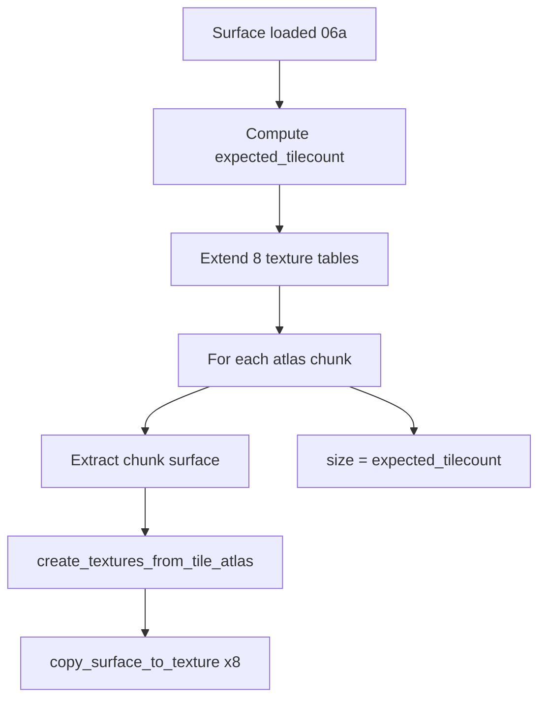

# 06b — Texture upload

Upload decoded sheet rasters into GPU-accessible sprite slots in the global texture tables.
Builds on grid math from [06a](./06a-atlas-grid.md). Per-pixel color filters (night, shadow,
etc.) are [06c](./06c-filtered-variants.md).

---

## Purpose

After loading a surface and computing `expected_tilecount`:

1. Reserve slots in parallel texture tables
2. Split large atlases to respect GPU max texture size
3. Upload each grid cell into `tile_values[global_index]` (and parallel tables via 06c)
4. Store each cell as **texture handle + source rectangle** (may share one GPU texture per chunk)

---

## Data model: `texture`

Each sprite slot holds:

```text
texture:
    gpu_texture    // shared across many slots in the same uploaded chunk
    source_rect    // sub-region (x, y, w, h) within gpu_texture
```

Draw code samples `source_rect` from `gpu_texture`. Multiple sprite indices can reference
the same `gpu_texture` with different rects (one upload chunk → one GPU texture).

Empty slot: `dimension() == (0, 0)` before write.

---

## Reserve slots

Before upload (non-`DYNAMIC_ATLAS`):

```text
for each of 8 parallel tables (see 06c):
    extend table length by expected_tilecount
```

Slots indexed `offset … offset + expected_tilecount - 1` must start empty.

`DYNAMIC_ATLAS`: skip vector extension; use batched atlas + lookup map (appendix A1).

---

## Max texture size

```text
if software_renderer:
    max_texture_width  = sprite_width
    max_texture_height = sprite_height
else:
    max_texture_width  = renderer.MAX_TEXTURE_SIZE
    max_texture_height = renderer.MAX_TEXTURE_SIZE

if max == 0:
    max_width  = sprite_width  * 128
    max_height = sprite_height * 256
else:
    require max >= sprite_width and max >= sprite_height
```

**Software renderer:** effectively **one sprite per GPU texture** (RLE surface extraction
is slow for sub-regions of a shared texture).

---

## Atlas splitting

Large PNGs are processed in a grid of **upload chunks**:

```text
max_tile_xcount = max_texture_width  / sprite_width
max_tile_ycount = max_texture_height / sprite_height

chunk_pixel_w = max_tile_xcount * sprite_width
chunk_pixel_h = max_tile_ycount * sprite_height

chunks_x = ceil(atlas_width  / max_texture_width)
chunks_y = ceil(atlas_height / max_texture_height)
```

Iterate `sub_rect` at `(cx * chunk_pixel_w, cy * chunk_pixel_h, chunk_pixel_w, chunk_pixel_h)`
for each chunk `(cx, cy)`.

```text
for each sub_rect in chunk grid:
    if sub_rect fully inside atlas bounds:
        surface_chunk = full atlas (use pixel offset sub_rect.x, sub_rect.y)
    else:
        w = min(atlas.w - sub_rect.x, sub_rect.w)
        h = min(atlas.h - sub_rect.y, sub_rect.h)
        surface_chunk = blit copy of atlas region (sub_rect.x, sub_rect.y, w, h)

    upload(surface_chunk, pixel_offset = (sub_rect.x, sub_rect.y))
```

Partial edge chunks still use correct global indices via pixel offset (06a).

---

## `copy_surface_to_texture`

Core per-chunk upload into one table (e.g. normal `tile_values`):

```text
copy_surface_to_texture(surface, pixel_offset, target_table):

    gpu_texture = create_gpu_texture_from_entire_surface(surface)
    if not gpu_texture: return false

    for each cell rect (rx, ry, sprite_width, sprite_height) in surface grid:
        pos = pixel_offset + (rx, ry)
        global_index = offset
                      + (pos.x / sprite_width)
                      + (pos.y / sprite_height) * (tile_atlas_width / sprite_width)

        assert target_table[global_index] is empty
        target_table[global_index] = texture(gpu_texture, cell_rect)

    return true
```

- `tile_atlas_width` = full **original** sheet width (06a), not chunk width
- `offset` = loader global base before this sheet
- Each chunk creates a **new** `gpu_texture` for its surface (cells in chunk share it)

---

## `create_textures_from_tile_atlas`

Called once per upload chunk. Default path (no `DYNAMIC_ATLAS`):

```text
create_textures_from_tile_atlas(surface, pixel_offset):
    for each of 8 variant tables:
        if variant has color filter function:
            filtered = apply_filter_copy(surface, filter)
            copy_surface_to_texture(filtered, pixel_offset, variant_table)
        else:
            copy_surface_to_texture(surface, pixel_offset, variant_table)
    return all succeeded
```

Filter details: unit [06c](./06c-filtered-variants.md). First table (`tile_values`) uses
unfiltered surface.

On failure → throw user-facing “failed to create texture atlas” (often low memory).

---

## Full sheet upload flow



After all chunks: `size = expected_tilecount` (06a). Caller then `offset += size`.

---

## `DYNAMIC_ATLAS` path

`create_textures_from_tile_atlas` delegates to `copy_surface_to_dynamic_atlas`:

- Iterates per **sprite cell** (not one texture per chunk)
- Copies cell into staging, hashes pixels, packs into dynamic atlas
- Inserts `tile_lookup[global_index]` → atlas sub-texture

See appendix A1. Grid index formula matches 06a.

---

## Port guidance (language-agnostic)

A minimal port needs:

| Capability | Required |
| --- | --- |
| Raster → GPU image | yes |
| Store sub-rect of a larger GPU image per sprite index | yes |
| Max texture size query or conservative limit | yes |
| Split uploads when `atlas_w > max_tex` | yes if supporting large sheets |
| Eight filtered duplicate tables | optional (06c); start with one normal table |

Indexed lookup at draw time: `tables[fx_type][sprite_index]` → texture + rect.

---

## BN source reference

| Concern | Location |
| --- | --- |
| Split + chunk loop | `src/cata_tiles.cpp` — `tileset_loader::load_tileset` |
| Per-chunk upload | `src/cata_tiles.cpp` — `create_textures_from_tile_atlas` |
| Cell → slot | `src/cata_tiles.cpp` — `copy_surface_to_texture` |
| Chunk iterator | `src/rect_range.h` — `rect_range` |
| Texture wrapper | `src/cata_tiles.h` — `texture` |
| Dynamic path | `src/cata_tiles.cpp` — `copy_surface_to_dynamic_atlas` |

---

## Inputs

- Decoded surface from 06a
- `expected_tilecount`, `tile_atlas_width`
- `sprite_width`, `sprite_height`, `offset`
- Renderer / GPU context

## Outputs

- `tile_values[offset … offset+size-1]` populated (and 7 variant tables if implementing 06c)
- Each slot: shared GPU texture + source rect
- `size` set on loader

## Failure modes

| Condition | Behavior |
| --- | --- |
| `CreateTextureFromSurface` fails | `copy_surface_to_texture` returns false → throw |
| `global_index` slot already set | Assert (logic error) |
| Max texture &lt; cell size | Throw before upload |
| Software renderer | Many small textures (one cell each) |

## Verification

A correct port should demonstrate:

1. 64×64 sheet, 32×32 cells, no split → 4 slots, one or few GPU textures
2. Slot `offset+2` rect points at correct quadrant of source image
3. Atlas wider than `max_texture_width` → multiple chunks, indices still contiguous
4. Edge chunk smaller than full chunk size uploads only valid cells
5. Re-upload same sheet without clearing → assert / error on duplicate index
6. Software path: each cell gets its own GPU texture object
