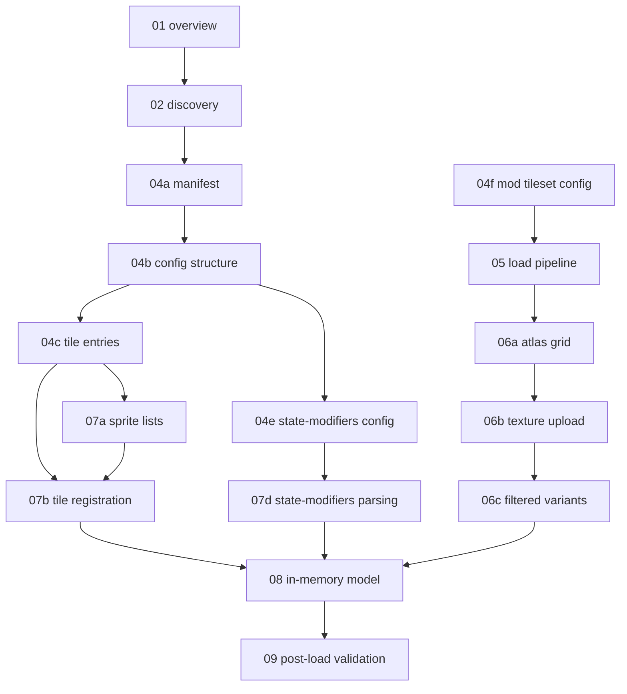

# Tileset loader specification — index and progress

Language-agnostic documentation extracted from Cataclysm-BN for reimplementing tileset
loading in another runtime. Each linked unit is a self-contained spec: inputs, outputs,
failure modes, and source references in this repository.

**Implementing in this repo?** Start with
[implementation-plan.md](./implementation-plan.md) — Java code under
[`core/src/main/java/io/gdx/cdda/bn/nextgen/tileset/`](../../core/src/main/java/io/gdx/cdda/bn/nextgen/tileset/).
Sprite browser: [../SPRITE_VIEWER.md](../SPRITE_VIEWER.md).

**Status key:** `todo` · `draft` · `review` · `done`

---

## Project scope

### In scope

- Discovering tilesets on disk
- Resolving paths from `tileset.txt` → `tile_config.json` → image sheets
- Parsing loader-facing JSON (`tile_config`, `mod_tileset`)
- Loading sprite atlases and building global sprite index space
- Registering tile definitions (including ASCII and state modifiers)
- Merging compatible mod tilesets
- Post-load cleanup and loading report
- Lifecycle: when loads run, caching, precheck vs full load, main vs overmap contexts

### Out of scope

| Topic | Notes |
| --- | --- |
| Draw-time tile lookup / rendering | Consumer of loaded data; see `src/cata_tiles.cpp` draw path |
| `looks_like` resolution at runtime | Used in loading report only, not during parse |
| `external_tileset` JSON | Game-data path, not gfx loader |
| `scripts/tileset.ts` compose tool | Build-time; loader reads composed output |
| Option UI wiring | Only document option **values** the loader reads (`TILES`, `OVERMAP_TILES`, `FORCE_TILESET_RELOAD`) |
| ASCII / `fallback.png` glyph sheets | Skipped for sprites-only port (units 04d, 07c cancelled) |

### Primary source files

| Area | Files |
| --- | --- |
| Discovery / registry | `src/options.cpp` (`build_tilesets_list`, `load_tilesets_from`) |
| Lifecycle / orchestration | `src/sdltiles.cpp`, `src/game.cpp`, `src/init.cpp`, `src/options.cpp` |
| Mod tileset registration | `src/mod_tileset.cpp`, `src/init.cpp` |
| Core loader | `src/cata_tiles.cpp` (`tileset_loader`, `cata_tiles::load_tileset`) |
| Data structures | `src/cata_tiles.h` (`tileset`, `tile_type`, `tileset_loader`) |
| Author reference (secondary) | `docs/en/mod/json/reference/graphics/tileset.md`, `mod_tileset.md` |

### Path conventions (BN)

| Symbol | Typical value |
| --- | --- |
| Game gfx root | `gfx/` (`PATH_INFO::gfxdir()`) |
| User gfx root | user config dir + `gfx/` (`PATH_INFO::user_gfx()`) |
| Manifest filename | `tileset.txt` |
| Default JSON | `tile_config.json` |
| Default image fallback | `tinytile.png` (when manifest omits `TILESET`) |

---

## Unit map

Units are ordered by dependency. Implement or document in roughly this order.

---

## Progress

| Unit | File | Status | Owner | Depends on |
| --- | --- | --- | --- | --- |
| 01 | [01-overview-and-lifecycle.md](./01-overview-and-lifecycle.md) | draft | | — |
| 02 | [02-discovery-and-registry.md](./02-discovery-and-registry.md) | draft | | 01 |
| 04a | [04a-tileset-manifest.md](./04a-tileset-manifest.md) | draft | | 02 |
| 04b | [04b-tile-config-structure.md](./04b-tile-config-structure.md) | draft | | 04a |
| 04c | [04c-tile-entries.md](./04c-tile-entries.md) | draft | | 04b |
| 04d | ~~04d-ascii-config.md~~ | **skipped** | | sprites-only port |
| 04e | [04e-state-modifiers-config.md](./04e-state-modifiers-config.md) | draft | | 04b |
| 04f | [04f-mod-tileset-config.md](./04f-mod-tileset-config.md) | draft | | 04b |
| 05 | [05-load-pipeline.md](./05-load-pipeline.md) | draft | | 04a–04f |
| 06a | [06a-atlas-grid.md](./06a-atlas-grid.md) | draft | | 05 |
| 06b | [06b-texture-upload.md](./06b-texture-upload.md) | draft | | 06a |
| 06c | [06c-filtered-variants.md](./06c-filtered-variants.md) | draft | | 06b |
| 07a | [07a-sprite-lists.md](./07a-sprite-lists.md) | draft | | 04c |
| 07b | [07b-tile-registration.md](./07b-tile-registration.md) | draft | | 07a |
| 07c | ~~07c-ascii-parsing.md~~ | **skipped** | | sprites-only port |
| 07d | [07d-state-modifiers-parsing.md](./07d-state-modifiers-parsing.md) | draft | | 04e |
| 08 | [08-in-memory-model.md](./08-in-memory-model.md) | draft | | 07b, 07d, 06c |
| 09 | [09-post-load-validation.md](./09-post-load-validation.md) | draft | | 08 |
| A1 | [appendix-dynamic-atlas.md](./appendix-dynamic-atlas.md) | draft | | 06b, 08 |

Update the **Status** column as work proceeds. Add **Owner** when assigning to an agent or person.

---

## Unit definitions

Each unit doc MUST end with:

1. **Inputs** — what the step receives
2. **Outputs** — what it produces or mutates
3. **Failure modes** — errors, warnings, fallbacks
4. **Verification** — how to confirm a correct port of this unit alone

---

### 01 — Overview and lifecycle

**File:** `01-overview-and-lifecycle.md`

**Extent:** When tileset loading runs; main vs overmap tileset contexts; precheck vs full
load; cache skip conditions; error handling (disable tiles, popups vs logs); option keys
read by the loader.

**Does not cover:** JSON field details, sprite math, draw path.

**Source anchors:** `src/init.cpp` (finalize step), `src/sdltiles.cpp` (`load_tileset`,
SDL init precheck), `src/game.cpp` (`reload_tileset`), `src/options.cpp` (option change
reload), `src/cata_tiles.cpp` (`cata_tiles::load_tileset` cache gate).

---

### 02 — Discovery and registry

**File:** `02-discovery-and-registry.md`

**Extent:** Scan `gfx/` then user gfx dir; find `tileset.txt` recursively; parse `NAME` /
`VIEW`; build `tileset_id → directory` registry; duplicate-name policy; merge order
(game data first, user overrides by dedup); empty-registry defaults.

**Does not cover:** Reading `JSON` / `TILESET` from manifest (see 04a).

**Source anchors:** `src/options.cpp` (`build_tilesets_list`, `build_resource_list`,
`load_tilesets_from`).

**Outputs:** `TILESETS` map, option list entries `(id, display_name)`.

---

### 04a — Tileset manifest

**File:** `04a-tileset-manifest.md`

**Extent:** `tileset.txt` format: `NAME`, `VIEW`, `JSON`, `TILESET`, comments (`#`), parsing
rules; `get_tile_information` defaults when keys or file missing.

**Does not cover:** Contents of `tile_config.json`.

**Source anchors:** `src/cata_tiles.cpp` (`get_tile_information`), example
`gfx/UltimateCataclysm/tileset.txt`.

---

### 04b — Tile config structure

**File:** `04b-tile-config-structure.md`

**Extent:** Top-level `tile_config.json`: required `tile_info` array; `tiles-new` per-sheet
wrapper (`file`, dimensions, offsets, transparency, optional sections); legacy single `tiles`
array + single image from manifest; BN fields read but overridden (document actual behavior).

**Does not cover:** Per-tile entry grammar (04c), ASCII (04d), state modifiers (04e).

**Source anchors:** `src/cata_tiles.cpp` (`tileset_loader::load`, `load_internal`).

---

### 04c — Tile entries (config)

**File:** `04c-tile-entries.md`

**Extent:** `tiles[]` object schema: `id` (string or array), `fg` / `bg` JSON shapes,
`rotates`, `multitile`, `additional_tiles`, `masks`, `flags`, `animated`, `height_3d`,
`default_tint`; ID naming conventions (season suffixes, overlay prefixes, `unknown`).

**Does not cover:** Algorithm that applies offsets to sprite indices (07a).

**Source anchors:** `docs/en/mod/json/reference/graphics/tileset.md` (legacy section),
`src/cata_tiles.cpp` (`load_tilejson_from_file`, `load_tile`).

---

### 04d — ASCII config — **skipped**

**Status:** Not documented. Sprites-only port does not load `ascii` arrays or `fallback.png`
glyph sheets.

BN uses ASCII ids (`ASCII_{char}{fg}{bg}`) as fallback when no entity sprite exists. If you
require every entity to have a sprite, reject or ignore `ascii` keys in JSON and treat missing
sheet images as errors instead of using the empty-ASCII-fallback skip in `load_internal`.

---

### 04e — State modifiers (config)

**File:** `04e-state-modifiers-config.md`

**Extent:** `state-modifiers` array on a `tiles-new` entry: group `id`, `override`,
`use_offset`, `whitelist` / `blacklist`, per-state `tiles` with `fg` null/int, offsets;
mod override semantics when group id matches base tileset.

**Does not cover:** UV warp at draw time.

**Source anchors:** `docs/en/mod/json/reference/graphics/mod_tileset.md`,
`src/cata_tiles.cpp` (`load_state_modifiers`).

---

### 04f — Mod tileset (config)

**File:** `04f-mod-tileset-config.md`

**Extent:** `type: mod_tileset`; `compatibility` list; reuse of `tiles-new`; multiple
objects per file; registration during game data load vs sprite load during main tileset load.

**Does not cover:** Compatibility check implementation details beyond id matching.

**Source anchors:** `src/mod_tileset.cpp`, `src/cata_tiles.cpp` (mod loop in `load`).

---

### 05 — Load pipeline

**File:** `05-load-pipeline.md`

**Extent:** End-to-end algorithm from `tileset_id` to loaded tileset: resolve directory,
open config, precheck early exit, iterate `tiles-new` / legacy path, advance global
`offset`, load mod tilesets in order, post-process hooks, assign `tileset_id`.

**Does not cover:** Field-level JSON grammar (04x) or GPU details (06x).

**Source anchors:** `src/cata_tiles.cpp` (`tileset_loader::load`, `load_internal`).

---

### 06a — Atlas grid

**File:** `06a-atlas-grid.md`

**Extent:** Load image from path; missing-file + empty ASCII fallback skip; transparency
color key; compute `size` (sprite count) from atlas dimensions and `sprite_width` /
`sprite_height`; per-sheet `offset` baseline.

**Does not cover:** Texture creation or color filters.

**Source anchors:** `src/cata_tiles.cpp` (`tileset_loader::load_tileset` through grid
setup).

---

### 06b — Texture upload

**File:** `06b-texture-upload.md`

**Extent:** Splitting atlases when exceeding max texture size; software-renderer one-sprite-
per-texture behavior; `copy_surface_to_texture`; extending global texture arrays; advancing
`offset` after each sheet.

**Does not cover:** Night/shadow/etc. filtered duplicates (06c).

**Source anchors:** `src/cata_tiles.cpp` (`create_textures_from_tile_atlas`,
`copy_surface_to_texture`).

---

### 06c — Filtered variants

**File:** `06c-filtered-variants.md`

**Extent:** Eight parallel sprite tables derived at load time (normal, shadow, night,
overexposed, underwater, underwater dark, z-overlay, memory); color filter functions applied
when building each table.

**Does not cover:** Dynamic atlas path (appendix).

**Source anchors:** `src/cata_tiles.cpp` (`create_textures_from_tile_atlas` non-
`DYNAMIC_ATLAS` branch).

---

### 07a — Sprite lists (parsing)

**File:** `07a-sprite-lists.md`

**Extent:** `load_tile_spritelists` behavior: int, rotation array, weighted object array;
`sprite_id_offset` addition; weight validation; allowed rotation counts (1, 2, 4).

**Outputs:** `weighted_int_list<std::vector<int>>` for fg/bg.

**Source anchors:** `src/cata_tiles.cpp` (`load_tile_spritelists`).

---

### 07b — Tile registration (parsing)

**File:** `07b-tile-registration.md`

**Extent:** `load_tile` / `load_tilejson_from_file`; multitile subtile ids (`{id}_{subid}`);
mask loading; `create_tile_type` and seasonal index population; invalid multitile errors.

**Source anchors:** `src/cata_tiles.cpp` (`load_tilejson_from_file`, `load_tile`,
`tileset::create_tile_type`).

---

### 07c — ASCII parsing — **skipped**

Same rationale as 04d. No `07c-ascii-parsing.md`.

---

### 07d — State modifiers (parsing)

**File:** `07d-state-modifiers-parsing.md`

**Extent:** Build `state_modifier_group` list; replace vs append when group id + filters
match; per-state fg sprite resolution; filter list normalization.

**Source anchors:** `src/cata_tiles.cpp` (`load_state_modifiers`).

---

### 08 — In-memory model

**File:** `08-in-memory-model.md`

**Extent:** `tileset` and `tile_type` fields after load; `tile_ids` map; seasonal cache;
sprite index → texture lookup; state modifier storage; invariants (stability until reload).

**Does not cover:** How draw code queries the model.

**Source anchors:** `src/cata_tiles.h`, `src/cata_tiles.cpp` (`tileset` methods).

---

### 09 — Post-load validation

**File:** `09-post-load-validation.md`

**Extent:** `process_variations_after_loading`; prune empty tiles; `unknown` warning;
`ensure_default_item_highlight`; `do_tile_loading_report` categories and missing-tile
detection.

**Source anchors:** `src/cata_tiles.cpp` (end of `load`, `do_tile_loading_report`,
`ensure_default_item_highlight`).

---

### A1 — Dynamic atlas (appendix)

**File:** `appendix-dynamic-atlas.md`

**Extent:** `DYNAMIC_ATLAS` compile-time alternate path: batch atlas, `tile_lookup` cache,
warp cache, `ensure_default_item_highlight` variant.

**Status:** Optional for ports that do not need BN's dynamic atlas. Document after 06b and 08.

**Source anchors:** `src/cata_tiles.h`, `src/cata_tiles.cpp` (`#if defined(DYNAMIC_ATLAS)` blocks).

---

## Suggested work phases

| Phase | Units | Goal |
| --- | --- | --- |
| 1 — Frame | 01, 02, 05 | Another agent can trace full load order |
| 2 — Config | 04a–04f | Complete JSON/manifest contract |
| 3 — Media | 06a–06c | Sprite index space and textures |
| 4 — Parse | 07a, 07b, 07d | Tile definitions in memory |
| 5 — Finish | 08, 09, A1 | Contract for consumers + validation |

---

## Changelog

| Date | Change |
| --- | --- |
| 2026-06-15 | Initial index: unit breakdown, scope, progress table |
| 2026-06-15 | Draft unit 01 — overview and lifecycle |
| 2026-06-15 | Draft unit 02 — discovery and registry |
| 2026-06-15 | Draft unit 04a — tileset manifest |
| 2026-06-15 | Draft unit 04b — tile config structure |
| 2026-06-15 | Draft unit 04c — tile entries |
| 2026-06-15 | Skip units 04d/07c (sprites-only port); draft unit 04e |
| 2026-06-15 | Draft unit 04f — mod tileset config |
| 2026-06-15 | Draft unit 05 — load pipeline |
| 2026-06-15 | Draft unit 06a — atlas grid |
| 2026-06-15 | Draft unit 06b — texture upload |
| 2026-06-15 | Draft unit 06c — filtered variants |
| 2026-06-15 | Draft unit 07a — sprite lists (parsing) |
| 2026-06-15 | Draft unit 07b — tile registration (parsing) |
| 2026-06-15 | Draft unit 07d — state modifiers (parsing) |
| 2026-06-15 | Draft unit 08 — in-memory model |
| 2026-06-15 | Draft unit 09 — post-load validation |
| 2026-06-15 | Draft appendix A1 — dynamic atlas |
| 2026-06-15 | Add implementation-plan.md for external repo ports |
| 2026-06-15 | Wire implementation target: Cataclysm-BN-nextgen + cygnus-engine reference |
| 2026-06-15 | Specs copied to Cataclysm-BN-nextgen `docs/tileset-loader/` |
