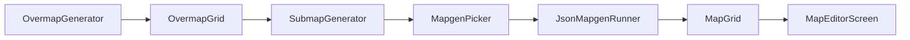

# 01 — Overview and scope

What **world generation** is in nextgen, how it differs from [mapgen preview](../mapgen-preview/01-overview-and-scope.md),
coordinate systems, and BN reference pipeline.

**Status:** draft

---

## Purpose

Build a **playable slice of BN world creation**:

1. An **overmap** — grid of overmap terrain (OMT) type ids
2. **On-demand submaps** — when the user (or game) visits `(omt_x, omt_y, z)`, pick mapgen and fill 24×24 cells

**User-facing goal (W2+W3):** pan a small overmap map, click a tile, see the correct field/house/lab floor in the editor.

---

## Coordinate systems

| Space | BN | Nextgen worldgen (target) |
| --- | --- | --- |
| Overmap (OMT) | ~180×180 default; `point_abs_omt` | `OvermapGrid` — v1: 8×8 … 64×64 |
| Submap | 24×24 cells per OMT (`SEEX`×`SEEY`) | `MapGrid` 24×24 from `JsonMapgenRunner` |
| Z-level | Multiple submaps stacked per OMT | v1: z=0; W3.1 adds z-stack |
| Rotation | OMT suffix + `object.rotation` | [MapGridRotator](../mapgen-preview/20-mapgen-rotation.md) — done |

One OMT tile in BN maps to **one** logical preview submap in nextgen (not 24×24 submaps per OMT — BN uses 2×2 submaps per OMT at the `map` level; defer full `mapbuffer` parity).

**v1 simplification:** treat each OMT cell as one 24×24 `MapGrid` (matches mapgen preview canvas size).

---

## Relationship to mapgen preview

```text
Mapgen preview                    Worldgen
─────────────────                 ─────────────────────────────
JsonMapgenDefinition (user pick)  OvermapTerrainRegistry → mapgen ids
JsonMapgenRunner                  JsonMapgenRunner (same)
MapGrid (one)                     SubmapCache (many)
MapEditor import dialog           Overmap click → visit
```

Worldgen **calls** preview; it does not duplicate runner logic.

---

## BN world generation pipeline (reference)

```text
World creation
  → load all JSON (mods, mapgen, overmap_terrain, specials, …)
  → pick region_settings
  → overmap::generate(seed)
       → place oceans / lakes / rivers
       → place forests, swamps, fields (terrain types)
       → place cities (city_building picks)
       → place static overmap_special
       → place mutable overmap_special (phases + joins)
       → highways / connections
  → overmapbuffer stores oter_id per OMT cell

Submap visit (player near OMT)
  → map::draw_map(mapgendata)
  → oter_mapgen.pick(om_terrain mapgen key)
  → mapgen_function_json::generate (or builtin/lua)
  → submap in mapbuffer
```

| Layer | BN source | Nextgen target |
| --- | --- | --- |
| OMT types | `overmap_terrain/` | W1 registry |
| Overmap layout | `overmap.cpp` | W2–W6 |
| Mapgen pick | `oter_mapgen` in `mapgen.cpp` | W3 |
| JSON mapgen run | `mapgen_function_json` | **Done** (preview) |
| City buildings | `multitile_city_buildings.json` | W4 + existing loader |
| Mutable specials | `overmap_mutable/` | W6 |

---

## Nextgen worldgen pipeline (target)

```text
Startup
  GameDataLoader.loadMods()
  OvermapTerrainLoader.load()     → OvermapTerrainRegistry   (W1)
  JsonMapgenLoader.load()         → MapgenCatalog            (existing)
  PaletteLoader.load()            → PaletteRegistry          (existing)

World create (seed)
  OvermapGenerator.generate(seed) → OvermapGrid              (W4+)

User selects OMT (x, y)
  SubmapGenerator.visit(grid, x, y, z, options)
    → resolve om_terrain id from cell
    → MapgenPicker.pick(terrain.mapgenList, seed, z)
    → JsonMapgenRunner.run(def, catalog, palettes, options)
    → SubmapCache.put(key, grid)
  MapEditorScreen.setGrid(grid)
```



---

## Out of scope (worldgen track)

| Topic | Notes |
| --- | --- |
| BN `.sav2` persistence | Separate future system |
| Full `mapbuffer` 2×2 submaps per OMT | Defer until submap visit stable |
| `method: builtin` / `lua` mapgen | Warn + skip |
| Avatar, NPCs, items on map | Simulation layer |
| Fog of war / exploration | Game client |
| Full 180×180 performance | Scale after W4 |

---

## Milestone map

| Milestone | User-visible result |
| --- | --- |
| W1 | Debug: list OMT types and mapgen refs |
| W2 | See colored/grid OMT map in editor |
| W3 | Click OMT → generated 24×24 terrain |
| W4 | Random town with real houses |
| W5 | Rivers and roads connect tiles |
| W6 | Lab / mall procedural specials |

---

## Verification

1. Doc distinguishes preview vs worldgen with coordinate table
2. Pipeline diagram shows `JsonMapgenRunner` reuse
3. W1 PR can start without W2 classes present
