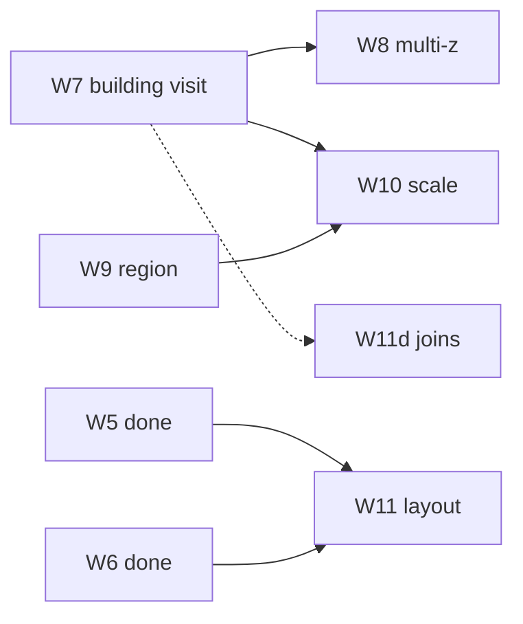

# 12 — v2 parity roadmap

Deferred BN worldgen features after W1–W6. Ordered for implementers; each row links to a unit
doc with algorithms, Java types, and verification.

**Implementation guide:** [v2-implementation-plan.md](./v2-implementation-plan.md)

**Status:** draft

---

## Purpose

W1–W6 prove **mini-overmap generation** and **single-piece visit**. v2 closes the gap between
**overmap click** and **mapgen picker import**, then improves layout fidelity and scale toward
BN `overmap::generate`.

**Core user story:** Generate a small overmap, click a placed house or lab, and see the same
multi-floor volume, spawn overlay, and floor cycling as `Ctrl+G` building import — without
manually picking the bundle.

---

## v1 vs BN (summary)

| Layer | BN | v1 (W1–W6) | v2 target |
| --- | --- | --- | --- |
| Overmap size | 180×180 default | 8–16 editor cycle | W10: 64–180 |
| Base terrain | `region_settings` weights + noise | forest/field noise | W9 |
| Placement | Cities, specials, mutable, roads | W4–W6 subset | W11 refines |
| Visit | `oter_mapgen` + building context | `MapgenPicker` one def | W7 volume |
| z-level | Full z stack per OMT | z=0 stub | W8 |
| Caching | `mapbuffer` | `SubmapCache` 64 | W10 tune |

---

## Gap inventory by subsystem

### A. Visit path (W7, W8, W11d)

| Gap | v1 code | v2 fix | Doc |
| --- | --- | --- | --- |
| Building bundles ignored on visit | `SubmapGenerator.visit` → `MapgenPicker.pick` only | `PlacedBuildingIndex` + `MapVolumeBuilder` | [13](./13-building-aware-visit.md) |
| `mapVolume` cleared after visit | `MapEditorScreen.visitSelectedOmtLoaded` sets `mapVolume = null` | `setMapVolume` like `applyBuildingImport` | W7 |
| Spawn markers per z | Single list from one grid | `spawnMarkersByZ` from volume build | W7 |
| Floor cycling `[` `]` | Mapgen import only | Wire after overmap visit | W7/W8 |
| z-aware mapgen pick | `MapgenPicker.pick(omtId, z, …)` partial | Roof/basement suffix + catalog z filter | [14](./14-multi-z-visit.md) |
| Active joins for nested | `withNeighborsByDirection` only | `withActiveJoins` from assembly | W11d in [17](./17-procedural-layout-v2.md) |

**Current visit flow (v1):**

```text
visitSelectedOmtLoaded()
  → WorldgenPreviewService.visit(overmap, x, y)   // z=0 implicit
  → SubmapGenerator.visit(...)
  → MapgenPicker.pick(omtId, z=0)
  → JsonMapgenRunner (single 24×24)
  → replaceGrid; mapVolume=null
```

**Target flow (W7+W8):**

```text
visitSelectedOmtLoaded(z)
  → placementIndex.findAt(x, y)
  → if building: MapVolumeBuilder → setMapVolume + activeZ grid
  → else: existing MapgenPicker path
  → floor UI + spawn overlay enabled
```

---

### B. Placement recording (W7 prerequisite)

| Gap | v1 code | v2 fix |
| --- | --- | --- |
| No placement list in generate result | `OvermapGenerateResult` — counts only | Add `PlacedBuildingIndex` / placement records |
| City centers tracked, not buildings | `CityPlacer` → `placedCenters.add(siteCenter(...))` | Record `buildingId`, anchor, rotation, footprint |
| Mutable specials not indexed | `MutableSpecialPlacer` adds center only | Record assembled layout + piece offsets |
| Static specials | Same as city via `CityPlacer.tryPlace` | Tag `placementKind` (city / static / mutable) |

`OvermapGenerateResult` today:

```java
// counts only — no (x,y) → building mapping
private final int cityBuildingsPlaced;
private final int staticSpecialsPlaced;
private final int mutableSpecialsPlaced;
```

W7 must extend generation to return **queryable placement data** retained by
`WorldgenPreviewService` alongside `OvermapGrid`.

---

### C. Overmap generation (W9, W11)

| Feature | v1 (W4–W6) | v2 unit |
| --- | --- | --- |
| Base fill | `BaseTerrainFiller` forest/field noise | [15](./15-region-settings-terrain.md) W9 — `overmap_terrain_settings` |
| City quota | `area/32` heuristic | W9 — `city_size` / building weights from region |
| Special quotas | `OvermapGenerateOptions` constants | W9 — `overmap_special_settings` subset |
| Rivers | One orthogonal path if w×h ≥ 64 | [17](./17-procedural-layout-v2.md) W11b — lakes + hydrology |
| Roads | MST over `placedCenters` | W11c — directional `overmap_connection` |
| Mutable specials | Single-phase bias, small joins | W11a — multi-phase + rotation |
| Generate order | fill → river → city → specials → roads | W11 — closer to BN ordering |

**v1 generate order** (`OvermapGenerator`):

```text
1. BaseTerrainFiller
2. RiverGenerator (if large enough)
3. CityPlacer
4. StaticSpecialPlacer
5. MutableSpecialPlacer
6. HighwayGenerator.connectSites(placedCenters)
```

---

### D. Editor integration (W7, W8, W10)

| Feature | v1 | v2 |
| --- | --- | --- |
| Overmap mode `M` | Tint + select + visit | W7 keeps volume context after visit |
| `cycleOvermapSize` | 8 / 12 / 16 | W10 adds 32 / 64 / optional 180 |
| `drawOvermapGrid` | Full grid each frame | W10 viewport culling |
| Regenerate `R` | Sync on small maps | W10 spinner for 64+ |
| Chunk borders overlay | Mapgen import | W7 from volume stitch bounds |
| Spawn overlay toggle | Works on single grid | W7 per-z markers from volume |

---

### E. Performance and scale (W10)

| Risk at 180×180 | Mitigation |
| --- | --- |
| 32k OMT cells drawn per frame | Viewport culling in overmap mode |
| Slow placement search | Reduced quotas at scale; spatial index deferred |
| Submap cache churn | Configurable 128–256 entries |
| Volume rebuild cost | Separate LRU volume cache (~16 entries) |

See [16](./16-overmap-scale.md).

---

## PR map (W7–W11)

| PR | User-visible win | Depends on | Unit doc |
| --- | --- | --- | --- |
| **W7** | Click house/lab → full building | W4 placement (extend recording) | [13](./13-building-aware-visit.md) |
| **W8** | Basement/roof visit | W7 volume context | [14](./14-multi-z-visit.md) |
| **W9** | Region-appropriate terrain mix | W4 generator hooks | [15](./15-region-settings-terrain.md) |
| **W10** | Large overmap usable in editor | W7 visit quality on 16×16 | [16](./16-overmap-scale.md) |
| **W11** | Rivers/roads/labs closer to BN | W5–W6, W9 for lakes | [17](./17-procedural-layout-v2.md) |



---

## Suggested order (with rationale)

1. **W7 — building-aware visit** — Highest user-visible win; unblocks spawn overlay and floor UI
   for procedural maps. Requires placement index but not W9/W10.
2. **W8 — multi-z** — Natural follow-on once `MapVolume` is wired; roof/basement OMT ids need z
   routing.
3. **W9 — region terrain** — Independent of W7; improves overmap *look* before scaling. Can
   parallelize with W8 if two contributors.
4. **W10 — scale** — Only after W7 visit is acceptable on 16×16; culling without volume visit
   is incomplete UX.
5. **W11 — layout v2** — Incremental sub-PRs (W11a–d); do not block W7–W10.

---

## Parallel tracks (not W7–W11)

These improve quality but are **not** overmap layout PRs:

| Topic | Why parallel | Doc |
| --- | --- | --- |
| Mutable specials in mapgen picker | Picker import, not worldgen visit | [11](./11-building-bundle-gaps.md) |
| `copy-from` bundle resolution | Mapgen catalog | [11](./11-building-bundle-gaps.md) |
| Mapgen runner polish | Shared engine | [08](./08-mapgen-post-v2-polish.md) |
| Game data G6+ | Spawn overlay content | [10](./10-game-data-g6-plus.md) |
| Editor rendering v2 | Tiles/multitile | [09](./09-editor-rendering-polish.md) |

---

## Success criteria (program level)

| Milestone | Criterion |
| --- | --- |
| W7 done | 16×16 overmap → click `2storyModern01` or lab OMT → multi-floor volume + spawn overlay |
| W8 done | Visit `_basement` / `_roof` OMT or change z → different grid than ground |
| W9 done | Switch region id → measurable change in forest/field/lake ratio on same seed |
| W10 done | 64×64 pan/zoom responsive; visit + cache work on corners |
| W11 done | Each sub-PR has tests; lab multi-phase assembles on 32×32 |

Full checklist: [v2-implementation-plan](./v2-implementation-plan.md#pr-checklist).

---

## v2 out of scope

| Topic | Reason |
| --- | --- |
| `.sav2` / world persistence | Separate game-client track |
| Full `mapbuffer` (2×2 submaps per OMT) | Defer past W10 |
| Builtin / Lua mapgen | Warn + skip (same as mapgen preview) |
| Avatar, NPCs, items in world | Simulation, not editor preview |
| Full BN hydrology / faction camps | W11 subset only |
| Infinite / chunked worlds | Not BN single-overmap model |

---

## BN source map (v2-relevant)

| Concern | Location |
| --- | --- |
| Overmap generate | `src/overmap.cpp` — `overmap::generate` |
| Building at visit | `src/mapgen.cpp` — `oter_mapgen`, building templates |
| Region settings | `data/json/regional_map_settings.json` |
| City buildings | `data/json/overmap/multitile_city_buildings.json` |
| Mutable specials | `data/json/overmap/overmap_mutable/` |
| Connections | `data/json/overmap/overmap_connection/` |

---

## Verification

1. Roadmap lists every v2 PR with unit doc link
2. Gap tables name concrete v1 classes (`SubmapGenerator`, `OvermapGenerateResult`, etc.)
3. W7 success criterion stated in [v2-implementation-plan](./v2-implementation-plan.md)
4. Out-of-scope table prevents save-format / simulation creep
5. Suggested order matches dependency graph
