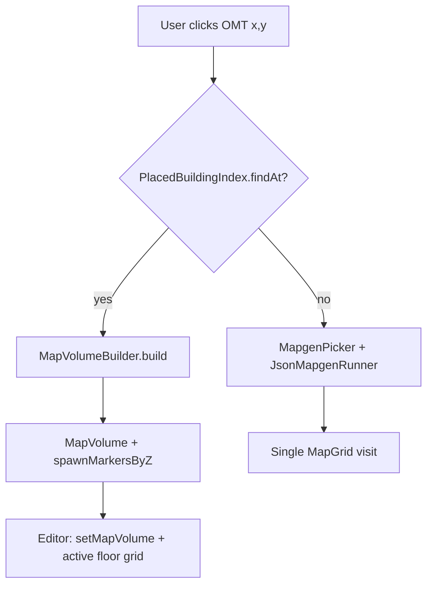

# 13 — Building-aware visit (W7)

Resolve **placed building bundles** when visiting an OMT cell; run **`MapVolumeBuilder`**
instead of a single `JsonMapgenDefinition`.

**Status:** done. See [v2-implementation-plan](./v2-implementation-plan.md).

---

## Purpose

W3 visit picks one mapgen def per OMT id. Multi-tile houses and labs need the same path as
[mapgen picker import](../MAPGEN_PREVIEW.md):

```text
CityBuildingDefinition  →  MapVolumeBuilder  →  MapVolume + spawn markers
```

**Picker path today** (`MapEditorScreen.applyBuildingImport`):

```java
mapgenService().generateBuilding(building, gameData, new JsonMapgenRunOptions());
setMapVolume(result.getVolume(), building);
setSpawnMarkersByZ(result.getSpawnMarkersByZ());
```

**Overmap visit today** (`visitSelectedOmtLoaded`):

```java
worldgenPreviewService.visit(overmapGrid, selectedOmtX, selectedOmtY);
replaceGrid(result.getGrid());
setSpawnMarkers(result.getSpawnMarkers());
mapVolume = null;   // ← drops multi-floor context
activeBuilding = null;
```

W7 makes overmap visit call the same building pipeline when the clicked cell belongs to a
placed footprint.

---

## Problem (concrete examples)

| Scenario | W3 behavior | Target (W7) |
| --- | --- | --- |
| `2storyModern01` 1×1 OMT on overmap | One floor's `JsonMapgenDefinition` | Full volume; `[`/`]` cycles basement → roof |
| `lab_mutagen_6_level` 5×5 mutable special | Single OMT's mapgen only | Stitched 120×120 ground + upper floors |
| `house_09` 2×1 city building | East wing mapgen in isolation | Both wings + shared reference canvas |
| `field` background OMT | Single mapgen (correct) | Unchanged W3 path |

---

## End-to-end flow (target)



```text
visit(overmap, omtX, omtY, z, worldSeed, placementIndex, buildingRegistry):
    omtId ← overmap.getOmtId(omtX, omtY)
    key ← SubmapKey(worldSeed, omtX, omtY, z)

    record ← placementIndex.findAt(omtX, omtY)
    if record.present():
        volumeKey ← VolumeCacheKey(worldSeed, record.buildingId, record.anchorX, record.anchorY)
        volume ← volumeCache.getOrBuild(volumeKey, () ->
            MapVolumeBuilder.build(record.definition, catalog, palettes, runOptions))

        activeZ ← ZLevelResolver.activeZForVisit(volume, z, omtId, record)
        grid ← volume.getGridAtZ(activeZ)
        markers ← volume.spawnMarkersAtZ(activeZ)
        return VisitResult.forBuilding(volume, grid, markers, record, ...)

    // fallback: existing W3
    return visitSingleMapgen(omtId, key, ...)
```

---

## Placement metadata (new)

`OvermapGenerateResult` today only stores counts — **not** which buildings landed where:

```java
// OvermapGenerateResult.java — current fields
cityBuildingsPlaced, staticSpecialsPlaced, mutableSpecialsPlaced
```

W7 extends generation to record placements:

| Class | Responsibility |
| --- | --- |
| `PlacedBuildingRecord` | One successful blit: id, anchor, definition ref, source kind |
| `PlacedBuildingIndex` | `(omtX, omtY) → record` for all piece cells |
| `OvermapGenerateResult` | Add `getPlacedBuildings()` / `getPlacementIndex()` |

### Building the index at generate time

Hook each placer when `pieceCount > 0`:

| Placer | `source` enum | `CityBuildingDefinition` from |
| --- | --- | --- |
| `CityPlacer.tryPlace` | `CITY` | `CityBuildingRegistry.find(id)` |
| `StaticSpecialPlacer` | `STATIC_SPECIAL` | registry |
| `MutableSpecialPlacer` | `MUTABLE` | synthesize from `MutableSpecialDefinition` + assembled layout |

**Index construction:**

```text
for each PlacedBuildingRecord record:
    footprint ← BuildingFootprint.atZ(record.definition, 0)  // overmap blit z
    for each piece in footprint.pieces:
        cellX ← record.anchorX + piece.offsetX
        cellY ← record.anchorY + piece.offsetY
        index.put(cellX, cellY, record)
```

For mutable specials, anchor is `baseX/baseY` from `MutableSpecialPlacer.tryPlace` (already
computed as `origin - minOffset`).

### Overlap policy

If two records map the same cell (should not happen after placement):

| Policy | Choice |
| --- | --- |
| Last write wins | Reject — log warning at index build |
| Prefer mutable > special > city | Document in placer order |

v1 generate order: cities → static specials → mutable → roads. Roads do not add building
records. Mutable overwrites OMT ids but index should reflect **final** grid owner = last placer
that blitted that cell.

---

## `PlacedBuildingRecord` shape

```java
public enum PlacementSource { CITY, STATIC_SPECIAL, MUTABLE }

public final class PlacedBuildingRecord {
    private final String buildingId;
    private final int anchorX;
    private final int anchorY;
    private final CityBuildingDefinition definition;
    private final PlacementSource source;

    public boolean contains(int omtX, int omtY) { … }
}
```

**Mutable → `CityBuildingDefinition`:** W6 may need a thin adapter that wraps
`AssembledSpecialLayout` into a synthetic `CityBuildingDefinition` (pieces list only), or
extend `MapVolumeBuilder` to accept assembled layouts directly. Prefer **adapter** to avoid
forking volume builder.

---

## `SubmapGenerator` changes

File: `core/.../worldgen/submap/SubmapGenerator.java`

| Step | Change |
| --- | --- |
| 1 | Add optional `PlacedBuildingIndex` + `CityBuildingRegistry` params |
| 2 | Before `MapgenPicker.pick`, call `index.findAt(omtX, omtY)` |
| 3 | Building branch: `MapgenPreviewService.generateBuilding(def, gameData, runOptions)` |
| 4 | Extend `VisitResult` with optional `MapVolume`, `CityBuildingDefinition` |

### `VisitResult` extensions

```java
public final class VisitResult {
    // existing: grid, warnings, spawnMarkers, fromCache, omtId

    private final MapVolume volume;              // nullable
    private final CityBuildingDefinition building;
    private final int activeZ;

    public boolean isBuildingVisit() { return volume != null; }
    public Optional<MapVolume> getVolume() { … }
}
```

### Run options for building visit

Match picker defaults plus worldgen context:

```java
final JsonMapgenRunOptions runOptions = new JsonMapgenRunOptions()
    .withPreviewSeed(SubmapSeed.mix(worldSeed, key))
    .withMapgenCatalog(catalog)
    .withGameData(gameData)
    .withNeighborsByDirection(collectNeighborsByDirection(overmap, omtX, omtY));
// RegionContext: same as mapgen preview when game data loaded
```

Do **not** set per-OMT `withOmtRotation` on the whole volume — rotation is per-piece inside
`MapVolumeBuilder` / stitch.

---

## Volume cache

Separate from per-cell `SubmapCache` (24×24 single grids):

| Cache | Key | Value |
| --- | --- | --- |
| `SubmapCache` | `(seed, x, y, z)` | `MapGrid` — non-building visits |
| `VolumeCache` (new) | `(seed, buildingId, anchorX, anchorY)` | `MapVolumeBuildResult` |

Building visit still returns one `MapGrid` (active floor) but editor holds full volume.

Invalidate both caches on `WorldgenPreviewService.setWorldSeed`.

---

## Editor wiring

File: `core/.../view/MapEditorScreen.java`

Replace `visitSelectedOmtLoaded` success branch:

```java
if (result.isBuildingVisit()) {
    setMapVolume(result.getVolume(), result.getBuilding());
    setSpawnMarkersByZ(result.getSpawnMarkersByZ());  // or single-floor from activeZ
    replaceGrid(result.getGrid());
} else {
    replaceGrid(result.getGrid());
    setSpawnMarkers(result.getSpawnMarkers());
    mapVolume = null;
    activeBuilding = null;
}
```

`WorldgenPreviewService` must retain last `OvermapGenerateResult` (or its index) after
`generateOvermap` so `visit` can resolve placements:

```java
private OvermapGenerateResult lastGenerated;
private PlacedBuildingIndex placementIndex;

public OvermapGenerateResult generateOvermap(...) {
    lastGenerated = OvermapGenerator.generate(...);
    placementIndex = PlacedBuildingIndex.fromResult(lastGenerated, cityBuildings);
    return lastGenerated;
}
```

---

## Active Z from clicked OMT

When user clicks one wing of a multi-floor building:

```text
activeZ ← volume.getActiveZ()  // default reference z from MapVolumeBuilder

if omtId matches suffix _basement / _second / _roof:
    activeZ ← ZLevelResolver.inferFromOmtId(omtId)  // W8 shares this helper

if pieceLayouts present:
    highlight piece containing (omtX, omtY) in HUD (existing hover helpers)
```

`MapVolumeBuilder` already picks `activeZ` from z=0 preference — visiting a roof OMT should
switch active floor to roof **without** rebuilding volume.

---

## Failure modes

| Condition | Behavior |
| --- | --- |
| OMT not in index | W3 single mapgen fallback |
| `buildingId` missing from registry | Warn; fallback single mapgen for `omtId` |
| `MapVolumeBuilder` throws | Catch; warn; fallback single mapgen |
| Mutable adapter incomplete | Skip mutable in index until adapter lands |
| `open_air` / `field` | Never in index; W3 only |
| Builtin mapgen only OMT | W3 warns (unchanged) |

---

## Files to touch (checklist)

| File | Change |
| --- | --- |
| `worldgen/visit/PlacedBuildingRecord.java` | new |
| `worldgen/visit/PlacedBuildingIndex.java` | new |
| `worldgen/visit/VolumeCache.java` | new (optional thin wrapper) |
| `worldgen/generate/CityPlacer.java` | return `PlacedBuildingRecord` on success |
| `worldgen/generate/StaticSpecialPlacer.java` | same |
| `worldgen/generate/MutableSpecialPlacer.java` | same + adapter |
| `worldgen/generate/OvermapGenerateResult.java` | placement list |
| `worldgen/submap/VisitResult.java` | volume + building fields |
| `worldgen/submap/SubmapGenerator.java` | building branch |
| `worldgen/WorldgenPreviewService.java` | hold index; pass to visit |
| `view/MapEditorScreen.java` | `setMapVolume` on building visit |

---

## Test plan

| Test | Assert |
| --- | --- |
| `PlacedBuildingIndexTest` | 2×1 footprint → cells (0,0) and (1,0) same record |
| `PlacedBuildingIndexTest` | non-building cell → empty |
| `SubmapGeneratorBuildingTest` | fixture overmap + placed `test_multitile` → `isBuildingVisit()` |
| `SubmapGeneratorBuildingTest` | volume floor count matches picker import |
| `VolumeCacheTest` | two OMT cells same building → one build |
| Integration (BN sibling) | `2storyModern01` on generated 16×16 → visit matches picker grid hash at z=0 |

### Fixtures

```text
core/src/test/resources/worldgen-fixtures/
  placements/
    house_2x1_placed.json     # overmap grid + expected index entries
  overmaps/
    with_city_building.json   # optional combined fixture
```

---

## BN source reference

| Concern | Location |
| --- | --- |
| Submap from multitile context | `src/map.cpp` — `map::draw_map` |
| Which mapgen runs | `src/mapgen.cpp` — `oter_mapgen` per submap coord |
| Building on overmap | `src/overmap.cpp` — `place_cities` / specials |

BN uses 2×2 submaps per OMT at the `mapbuffer` layer — W7 still emits one 24×24 preview grid per
visit (see [01-overview](./01-overview-and-scope.md)).

---

## Verification

1. Overmap visit on house OMT matches picker import for same seed (ground floor ter/furn sample)
2. `[` / `]` floor cycle works after overmap visit without re-import
3. Spawn overlay (`O`) shows markers on visited lab/security floors
4. Chunk borders (`B`) visible on stitched lab ground floor
5. `field` visit still uses single-grid path (no regression)

---

## Dependencies

| Requires | PR | Status |
| --- | --- | --- |
| W3 visit + cache | W3 | done |
| W4 placement | W4 | done |
| W6 mutable place | W6 | done |
| `MapVolumeBuilder` | P5–P6 | done |
| `MapgenPreviewService.generateBuilding` | preview | done |
| Spawn collection | P13b + stitch fixes | done |

---

## Does not include (W8+)

- z-aware `MapgenPicker` for non-building OMTs → [14](./14-multi-z-visit.md)
- `activeJoins` for nested mapgen → [17](./17-procedural-layout-v2.md) W11d
- Persisting placement index to save file
