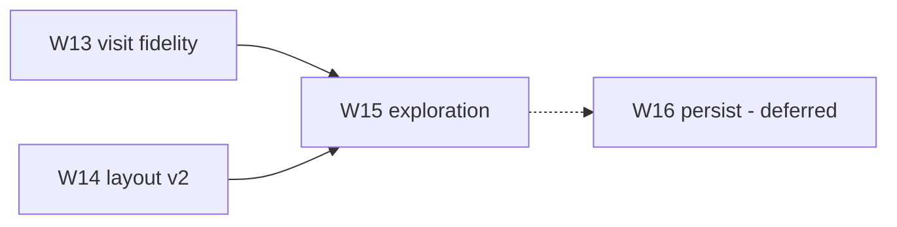

# 18 — World map v3 roadmap

Next phase after **v2 (W7–W11)**: deepen **visit fidelity**, **layout parity**, and
**exploration** — without world save/load yet.

**Status:** draft. See [v3-implementation-plan](./v3-implementation-plan.md).

**Deferred:** [22](./22-world-persistence.md) (W16) — persistence is explicitly **not** v3 phase 1.

---

## Purpose

v2 made a procedural overmap **previewable** at BN scale with building-aware visit. v3 moves
toward a **navigable world slice** that content authors and (later) a game client can trust:

1. Submaps at OMT edges match BN stitching expectations
2. Generated layout reflects more of `region_settings` and BN placement passes
3. The editor tracks **where you have been** and **where you are** on the overmap

Persistence (save/load) waits until visit + layout + exploration behavior is stable.

---

## v2 recap (done)

| Layer | v2 |
| --- | --- |
| Visit | W7 volume, W8 multi-z, W11d active joins |
| Layout | W9 region fill, W11 lakes/roads/mutable |
| Scale | W10 culling, 8–256 overmap, async generate |
| State | In-memory only; regen loses everything |

Gap inventory: [12-v2-parity-roadmap](./12-v2-parity-roadmap.md).

**Post–W14 CDDA parity (why maps still look unlike BN):** [23](./23-cdda-parity-overview.md) ·
[24](./24-cdda-layout-gaps.md) · [25](./25-cdda-region-visit-world-gaps.md).

**v4 Tier A (formal):** [27](./27-world-map-v4-roadmap.md) · [26](./26-tier-a-urban-layout.md) ·
[v4-implementation-plan](./v4-implementation-plan.md).

---

## v3 themes (priority order)

| Priority | Theme | PR | Unit doc |
| --- | --- | --- | --- |
| **1** | Visit / mapbuffer fidelity | **W13** | [19](./19-visit-mapbuffer-fidelity.md) |
| **2** | Layout parity phase 2 | **W14** | [20](./20-layout-parity-phase2.md) |
| **3** | Exploration & world coords | **W15** | [21](./21-exploration-and-world-coords.md) |
| — | World persistence (deferred) | **W16** | [22](./22-world-persistence.md) |

**Rationale:** Stitch and nested-context correctness (W13) should settle before exploration
cache policy (W15). Layout (W14) is largely independent and can parallel W13. Persistence (W16)
needs a stable in-memory world model from W15.

---

## v3 vs BN (summary)

| Layer | BN | v2 | v3 target |
| --- | --- | --- | --- |
| Submaps per OMT | 2×2 in `mapbuffer` | One 24×24 preview grid | W13: mapbuffer **or** documented stitch fixes |
| Region placement | Full `region_settings` tables | Forest/lake + city weights subset | W14: specials, city size, swamps |
| World state | `overmapbuffer` + save | `OvermapGrid` in RAM | W15: seen/visited + world coords |
| Save file | `.sav2` | None | W16 deferred |

---

## Gap inventory by theme

### A. Visit fidelity (W13)

| Gap | v2 code | v3 fix |
| --- | --- | --- |
| One 24×24 per OMT visit | `SubmapGenerator` → single `MapGrid` | `Mapbuffer` slice or edge-case fixes |
| Nested `connections` checks | W11d joins only | Pass road connection context |
| Builtin / Lua mapgen | Warn + skip | Document; optional builtin subset |
| Multitile edge alignment | `MapVolumeBuilder` stitch | Verify corner OMTs at volume bounds |

See [19](./19-visit-mapbuffer-fidelity.md).

### B. Layout parity phase 2 (W14)

| Gap | v2 | v3 |
| --- | --- | --- |
| `overmap_special_settings` | Not consumed | Weighted static/faction specials |
| `city_size` / urban spacing | Heuristic quotas | Region-driven city placement |
| Swamps, beaches, thick forest | Forest noise only | Extra region terrain passes |
| Subways / rails / sewers | Out of W11 | Optional sub-PRs or defer to v4 |

See [20](./20-layout-parity-phase2.md).

### C. Exploration & coords (W15)

| Gap | v2 | v3 |
| --- | --- | --- |
| Seen OMT state | None | Per-cell flags on overmap session |
| World position | Overmap cell only | `WorldCoord` (omx, omy, z) + optional avatar stub |
| Visit cache policy | LRU by seed+cell | Invalidate on layout edit; respect exploration |
| Overmap tint | Uniform | Dim unseen / highlight visited |

See [21](./21-exploration-and-world-coords.md).

### D. Persistence (W16 — deferred)

| Topic | Notes |
| --- | --- |
| Save/load world package | After W15 in-memory model exists |
| Submap cache serialisation | Optional; large on disk |
| `.sav2` interop | Out of scope for W16 v1 |

See [22](./22-world-persistence.md).

---

## Suggested implementation order

1. **W13a** — Audit stitch edge cases; fix top failures without full mapbuffer (if sufficient)
2. **W13b** — `Mapbuffer` / 2×2 submap model (only if W13a insufficient)
3. **W14a** — `overmap_special_settings` + region special weights
4. **W14b** — `city_size` and urban density from region
5. **W14c** — Swamp / beach / thick forest passes (region tables)
6. **W15a** — `ExplorationState` + overmap seen/visited rendering
7. **W15b** — World coords + move-between-OMT in editor (keyboard or click-adjacent)
8. **W16** — Persistence (when requested)

W13 and W14 can run in parallel by different contributors.

---

## Success criteria (program level)

| Milestone | Criterion |
| --- | --- |
| W13 done | Corner OMT of multitile building matches picker import; nested `connections` test passes |
| W14 done | Switch region → measurable change in special count/type on same seed |
| W15 done | Revisit OMT shows cache hit; unseen cells visually distinct; coord HUD shows position |
| W16 done | (deferred) Save world JSON → reload → same grid + exploration flags |

---

## v3 out of scope

| Topic | Reason |
| --- | --- |
| `.sav2` import/export | W16 deferred; BN binary format |
| Full `overmap::generate` port | W14 subset only — see [24](./24-cdda-layout-gaps.md) |
| Multi-overmap world (many 180×180) | Single overmap per session in v3 |
| NPC simulation, combat, turn loop | Game client track |
| Infinite / streaming worlds | Not BN model |
| Lua mapgen full port | Unless W13 explicitly adds builtin subset |

---

## BN source map (v3-relevant)

| Concern | Location |
| --- | --- |
| `mapbuffer` / submap grid | `src/mapbuffer.cpp`, `src/map.cpp` |
| `draw_map` / visit | `src/mapgen.cpp` — `oter_mapgen` |
| Region specials | `regional_map_settings.json` — `overmap_special_settings` |
| City size | `region_settings` — `city` block |
| Exploration | `src/overmap.cpp` — `seen`, `explored` flags |
| Overmap generate (remaining) | `src/overmap.cpp` — `overmap::generate` |

---

## Verification

1. Roadmap lists W13–W15 with unit doc links; W16 marked deferred
2. Dependency graph shows persistence after exploration
3. Each unit doc has concrete Java types and tests section
4. [README](./README.md) and [WORLDGEN.md](../WORLDGEN.md) index v3 milestones
