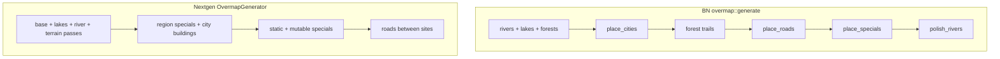

# 23 — CDDA / BN parity overview

What **Cataclysm: Bright Nights** does in `overmap::generate` vs what **nextgen** implements
today — after W1–W14. Use this as the entry point for gap analysis and prioritization.

**Status:** draft

**Detail docs:**

| Doc | Focus |
| --- | --- |
| [24](./24-cdda-layout-gaps.md) | Overmap layout — cities, roads, hydrology, specials |
| [25](./25-cdda-region-visit-world-gaps.md) | Region JSON, visit time, world / persistence |

**Related:** [12-v2-parity-roadmap](./12-v2-parity-roadmap.md) (pre-v3) · [18-world-map-v3-roadmap](./18-world-map-v3-roadmap.md) (W13–W16 plan)

---

## Purpose

W13–W14 closed documented v3 milestones (stitch/connections, region specials, urban spacing,
swamp/beach passes). Generated maps can still look **unlike BN**: one river, roads in empty
wilderness, no shop grids or highway interchanges.

That is expected: nextgen is a **preview stack**, not a port of full `overmap::generate`. This
doc names the remaining gaps so implementers and content authors know what “parity” means at each
tier.

---

## Pipeline comparison

### BN (`overmap::generate` — `src/overmap.cpp` ~3393)

```text
neighbor connection stitch (north/east/south/west)
→ place_rivers
→ place_lakes (if region threshold)
→ place_forests + place_swamps
→ place_cities                    ← full urban simulation
→ place_forest_trails
→ place_roads                     ← highway network + neighbor continuity
→ place_specials                  ← weighted batches + constraints
→ place_forest_trailheads
→ polish_rivers
→ place_mongroups + place_radios  ← gameplay, not layout art
```

### Nextgen (`OvermapGenerator` — non-legacy order)

```text
BaseTerrainFiller (region forest/field noise)
→ LakeGenerator
→ RiverGenerator (single carve)
→ ThickForestGenerator / SwampGenerator / BeachGenerator (W14c)
→ RegionSpecialPlacer (W14a)
→ CityPlacer                      ← few multitile city_building drops
→ StaticSpecialPlacer (quota fallback)
→ MutableSpecialPlacer
→ HighwayGenerator.connectSites   ← MST between placed site centers only
```



**Key ordering difference:** BN generates **cities before roads** and **roads before most
specials**. Nextgen places **roads last** and only between **already-recorded** placement
centers — not a world-spanning road graph.

---

## Layer summary

| Layer | BN | Nextgen (post-W14) | Gap doc |
| --- | --- | --- | --- |
| Overmap layout | Full generate pipeline | Simplified passes + quotas | [24](./24-cdda-layout-gaps.md) |
| Region JSON | All `region_settings` blocks | Subset (forest, lake, city houses, W14 tables) | [25](./25-cdda-region-visit-world-gaps.md) |
| Visit (click OMT) | `oter_mapgen` + mapbuffer 2×2 | JSON mapgen + volume stitch (W13) | [25](./25-cdda-region-visit-world-gaps.md) |
| World state | `overmapbuffer`, seen/explored, save | Single overmap in RAM; W15 todo | [25](./25-cdda-region-visit-world-gaps.md) |

---

## What W13–W14 actually fixed

| Milestone | Fixed | Did **not** fix |
| --- | --- | --- |
| **W13** | Neighbor joins, `overmap_connection` at stitch, placement context in volume build | Full `mapbuffer` (2×2 submaps per OMT); builtin/Lua mapgen |
| **W14** | `overmap_special_settings` weights, `city_size`/`city_spacing`, swamp/beach/thick forest | `place_cities` (shops/parks/finales); `place_roads` (highway grid); W14d subways/rails |

W14 success criterion was **measurable region-driven mix on same seed** — not visual identity
with BN screenshots.

---

## Parity tiers (suggested roadmap)

Use these when scoping PRs after W15.

### Tier A — “Looks more like CDDA” (layout)

Highest impact for overmap screenshots.

| Item | BN | Priority |
| --- | --- | --- |
| City simulation subset | `place_cities` — houses, shops, parks, finales inside urban blobs | P0 |
| Road network | `place_roads` — inter-city highways, interchanges, bridges | P0 |
| Special placement rules | `city_sizes`, min/max distance, phase batches | P1 |
| Hydrology v2 | Multiple rivers, `polish_rivers`, ocean/coast | P1 |
| Forest trails + trailheads | `place_forest_trails`, `place_forest_trailheads` | P2 |
| Subways / rails / sewers | W14d deferred | P2 |

See [24](./24-cdda-layout-gaps.md) for per-feature tables.

### Tier B — “Feels like CDDA” (visit)

| Item | BN | Priority |
| --- | --- | --- |
| Optional `Mapbuffer` (2×2 submaps) | Corner alignment at OMT interior | P1 if stitch gaps remain |
| Builtin mapgen subset | Common `oter_mapgen` builtins | P2 |
| Region picker in editor | Compare `regional_map_settings` profiles | P1 |

### Tier C — “Is CDDA” (out of v3 scope)

| Item | Notes |
| --- | --- |
| Neighbor overmap stitching | Roads/rivers across 180×180 boundaries |
| `place_mongroups`, radios, faction camps | Gameplay simulation |
| `.sav2` / `overmapbuffer` | [22](./22-world-persistence.md) deferred |
| Full `overmap::generate` port | Not a goal; incremental Tier A/B instead |

---

## Comparing with BN (debug workflow)

Nextgen exports the generated OMT grid for diffing:

1. Map editor → **M** (overmap mode) → **R** (regenerate)
2. **Ctrl+Shift+C** — copies JSON to clipboard and writes `maps/overmap_export.json`
3. Note `seed`, `regionId`, `stats` (building/special/river/road counts)
4. In BN, same seed + region → inspect or dump overmap terrain ids
5. Diff `rows` — expect BN `road_*`, `s_gas`, `house_*` density vs nextgen `field`/`forest` +
   sparse building OMTs

Exporter: `worldgen/overmap/OvermapGridExporter.java`.

**Editor default:** `OvermapGenerateOptions.forSize(w, h)` uses `regionId: "default"`. Real BN
world profiles require `withRegionId(...)` and loaded `RegionSettingsRegistry` from
`data/json/regional_map_settings.json` — see [25](./25-cdda-region-visit-world-gaps.md).

---

## BN source map

| Concern | Location |
| --- | --- |
| Generate order | `src/overmap.cpp` — `overmap::generate` (~3420) |
| Cities | `overmap::place_cities` (~4781) |
| Roads | `overmap::place_roads` (~4615) |
| Rivers | `overmap::place_rivers`, `polish_rivers` |
| Specials | `overmap::place_specials` (~6176) |
| Region data | `data/json/regional_map_settings.json` |
| Visit | `src/mapgen.cpp` — `oter_mapgen` |
| Submaps | `src/mapbuffer.cpp` |

---

## Verification

1. Overview lists BN vs nextgen generate order side by side
2. Tier A/B/C table gives implementers a priority ladder
3. [24](./24-cdda-layout-gaps.md) and [25](./25-cdda-region-visit-world-gaps.md) exist with
   concrete Java class names
4. [README](./README.md) indexes units 23–25 under “CDDA parity”
