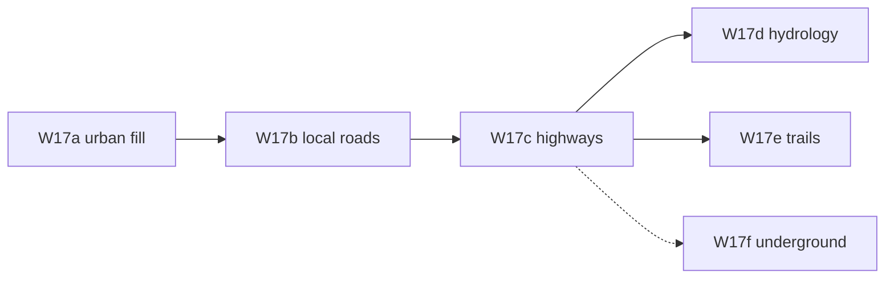

# 27 — World map v4 roadmap (Tier A layout)

Next phase after **v3 (W13–W16)**: **Tier A** overmap layout parity — urban fill, local roads,
inter-city highways — so generated maps resemble BN `place_cities` / `place_roads` screenshots.

**Status:** draft. See [v4-implementation-plan](./v4-implementation-plan.md).

**Gap inventory:** [23-cdda-parity-overview](./23-cdda-parity-overview.md) · [24-cdda-layout-gaps](./24-cdda-layout-gaps.md)

**Deferred from v3:** W15 exploration and W16 persistence can proceed **in parallel** with W17; they
do not block Tier A layout work.

---

## Purpose

v3 (W13–W14) improved visit stitch and region-driven terrain/special **mix**. Maps still look
unlike BN: sparse multitile buildings, MST roads in wilderness, no shop grids.

v4 **Tier A** targets the **overmap layout** layer only — not full `overmap::generate` port, not
neighbor overmap stitching, not save format.

---

## v3 recap (relevant to v4)

| Layer | v3 state |
| --- | --- |
| Visit | W13 joins + connections; JSON mapgen + volume |
| Layout | W14 region specials, city spacing, swamp/beach |
| Exploration | W15 todo |
| Persistence | W16 deferred |

---

## v4 themes (priority order)

| Priority | Theme | PR | Unit doc |
| --- | --- | --- | --- |
| **1** | Urban OMT fill (shops, parks, houses, finales) | **W17a** | [26](./26-tier-a-urban-layout.md) |
| **2** | In-city local road grid | **W17b** | [26](./26-tier-a-urban-layout.md) |
| **3** | Inter-city highway network + generate reorder | **W17c** | [26](./26-tier-a-urban-layout.md) |
| **4** | Hydrology v2 (multi-river, polish) | **W17d** | [26](./26-tier-a-urban-layout.md) |
| **5** | Forest trails + trailheads | **W17e** | [26](./26-tier-a-urban-layout.md) |
| **6** | Subways / rails / sewers | **W17f** | [26](./26-tier-a-urban-layout.md) |

**Rationale:** Urban content must exist before local roads matter; local roads before highways
connect city cores. Hydrology and trails are independent P1/P2 polish. W17f reopens deferred W14d.

---

## v4 vs BN (summary)

| Layer | BN | v3 (post-W14) | v4 Tier A target |
| --- | --- | --- | --- |
| City blobs | `place_cities` — dense OMT fill | Few `city_building` multitiles | W17a urban OMT placer |
| Local streets | `local_road` inside cities | — | W17b |
| Highways | `place_roads` city-to-city graph | MST between all sites | W17c |
| Generate order | cities → trails → roads → specials | roads last | W17c reorder |
| Rivers | Multi + polish | Single carve | W17d |
| Trails | `forest_trail` region | — | W17e |

---

## Success criteria (program level)

| Milestone | Criterion |
| --- | --- |
| W17a done | 64×64 `default` region → export contains shop/park/house OMT ids inside urban blob |
| W17b done | Same seed → `road_*` grid inside city radius; local roads ≠ highway only |
| W17c done | Highways connect city **centers**; wilderness between cities mostly field/forest |
| W17d done | ≥2 river segments or polish pass; tests on fixture hydrology region |
| Tier A done | Manual: overmap screenshot “reads as a town + highways” vs v3 wilderness roads |

**Compare:** Map editor **M** → **R** → **Ctrl+Shift+C** → `maps/overmap_export.json` (seed,
`regionId`, `stats`).

---

## v4 out of scope

| Topic | Reason |
| --- | --- |
| Neighbor overmap stitching | Tier C — [24](./24-cdda-layout-gaps.md) |
| Full `place_cities` port | Incremental W17 subset |
| `place_mongroups`, radios | Gameplay |
| `.sav2` / W16 persistence | Separate when W15 exists |
| Builtin / Lua mapgen | Tier B — [25](./25-cdda-region-visit-world-gaps.md) |
| Region picker UI | Tier B; can land anytime |

---

## BN source map (v4-relevant)

| Concern | Location |
| --- | --- |
| Cities | `src/overmap.cpp` — `overmap::place_cities` (~4781) |
| Roads | `overmap::place_roads` (~4615) |
| Rivers / polish | `place_rivers`, `polish_rivers` |
| Forest trails | `place_forest_trails`, `place_forest_trailheads` |
| Region city tables | `data/json/regional_map_settings.json` — `city` block |
| Local road connection | `data/json/overmap/overmap_connection/` — `local_road` |

---

## Verification

1. Roadmap lists W17a–f with dependency graph
2. [26-tier-a-urban-layout](./26-tier-a-urban-layout.md) has algorithms, types, tests
3. [v4-implementation-plan](./v4-implementation-plan.md) has PR checklist
4. [README](./README.md) indexes v4 milestones
