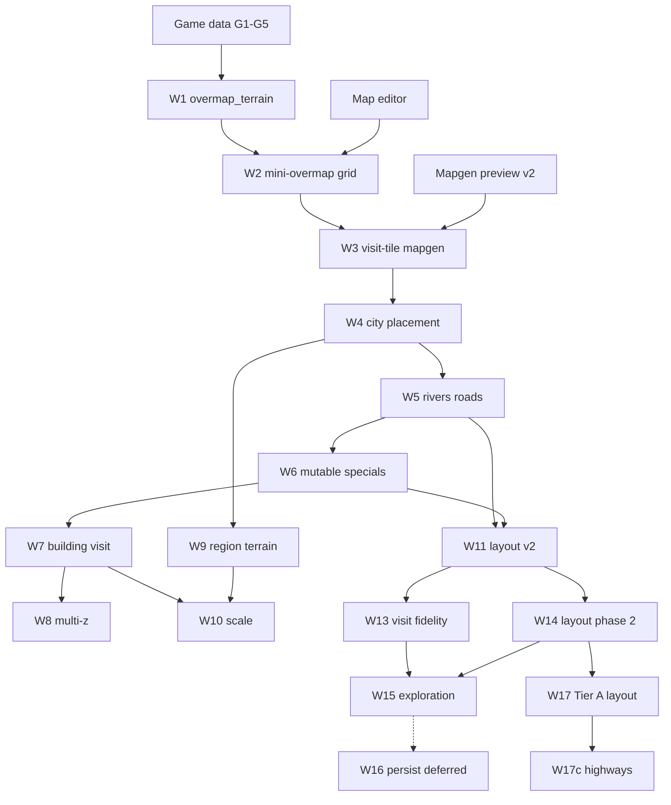

# World generation specification — index and progress

Specs for **BN-style overmap layout + on-demand submap generation** in LibGDX nextgen.

**Implementing?** Start with [implementation-plan.md](./implementation-plan.md) and
[WORLDGEN.md](../WORLDGEN.md).

**Status key:** `todo` · `draft` · `review` · `done`

---

## Consumes

| Upstream | Provides |
| --- | --- |
| [Game data loader](../game-data-loader/README.md) | Terrain/furniture ids (G1–G5) |
| [Mapgen preview](../mapgen-preview/README.md) | `JsonMapgenRunner`, catalogs, bundles |
| [Map editor](../map-editor/README.md) | `MapGrid`, camera, render |
| [Tileset loader](../tileset-loader/README.md) | Sprites |

---

## Does not replace

- **Mapgen preview** — still used for picker import and as the submap engine inside worldgen
- **Full BN parity** — Lua mapgen, every builtin generator, save format, simulation

---

## Worldgen milestones (W1–W6)

| Unit | Topic | PR | Status |
| --- | --- | --- | --- |
| [01](./01-overview-and-scope.md) | Preview vs worldgen; coordinates; BN pipeline | — | draft |
| [02](./02-overmap-terrain-loader.md) | `overmap_terrain` JSON → registry | **W1** | done |
| [03](./03-mini-overmap-grid.md) | Fixed-size OMT grid; editor overmap view | **W2** | done |
| [04](./04-visit-tile-mapgen.md) | Weighted mapgen pick; submap cache | **W3** | done |
| [05](./05-city-and-special-placement.md) | Cities, static `overmap_special` | **W4** | done |
| [06](./06-rivers-roads-connections.md) | Rivers, highways, `overmap_connection` | **W5** | done |
| [07](./07-mutable-specials-and-joins.md) | Procedural specials, joins, phases | **W6** | done |

**Plan:** [implementation-plan.md](./implementation-plan.md) (W1–W6) · [v2-implementation-plan.md](./v2-implementation-plan.md) (W7–W11)

---

## Worldgen v2 milestones (W7–W11)

| Unit | Topic | PR | Status |
| --- | --- | --- | --- |
| [12](./12-v2-parity-roadmap.md) | v2 gap inventory; suggested order | — | draft |
| [13](./13-building-aware-visit.md) | `MapVolumeBuilder` on overmap visit | **W7** | done |
| [14](./14-multi-z-visit.md) | z-aware pick; floor visit | **W8** | done |
| [15](./15-region-settings-terrain.md) | `region_settings` base fill | **W9** | done |
| [16](./16-overmap-scale.md) | 64×64–180×180; culling | **W10** | done |
| [17](./17-procedural-layout-v2.md) | Rivers, roads, mutable, joins | **W11** | done |

---

## Worldgen v3 milestones (W13–W16)

**Plan:** [v3-implementation-plan.md](./v3-implementation-plan.md) · **Roadmap:** [18-world-map-v3-roadmap.md](./18-world-map-v3-roadmap.md)

| Unit | Topic | PR | Status |
| --- | --- | --- | --- |
| [18](./18-world-map-v3-roadmap.md) | v3 gap inventory; persistence deferred | — | draft |
| [19](./19-visit-mapbuffer-fidelity.md) | Stitch / mapbuffer / nested connections | **W13** | done |
| [20](./20-layout-parity-phase2.md) | Region specials, city size, swamps | **W14** | done |
| [21](./21-exploration-and-world-coords.md) | Seen/visited, world coords | **W15** | todo |
| [22](./22-world-persistence.md) | Save/load world (deferred) | **W16** | deferred |

---

## CDDA / BN parity (post–W14 inventory)

What nextgen still lacks vs BN `overmap::generate` after W13–W14 milestones.

| Unit | Topic | Status |
| --- | --- | --- |
| [23](./23-cdda-parity-overview.md) | Parity overview; tiers; BN vs nextgen pipeline | draft |
| [24](./24-cdda-layout-gaps.md) | Layout — cities, roads, hydrology, specials | draft |
| [25](./25-cdda-region-visit-world-gaps.md) | Region JSON, visit, exploration, persistence | draft |

---

## Worldgen v4 milestones (W17 — Tier A layout)

**Plan:** [v4-implementation-plan.md](./v4-implementation-plan.md) · **Roadmap:** [27-world-map-v4-roadmap.md](./27-world-map-v4-roadmap.md)

| Unit | Topic | PR | Status |
| --- | --- | --- | --- |
| [27](./27-world-map-v4-roadmap.md) | v4 Tier A roadmap; W17 dependency graph | — | draft |
| [26](./26-tier-a-urban-layout.md) | Urban fill, local roads, highways | **W17** | W17a–f done |

W17 sub-PRs: **W17a** urban OMT ✓ · **W17b** local roads ✓ · **W17c** highways ✓ · **W17d** hydrology ✓ · **W17e** trails ✓ · **W17f** underground ✓.

---

## Post–mapgen-v2 follow-ups (parallel)

These improve preview/worldgen quality but are **not** overmap layout:

| Unit | Topic | Status |
| --- | --- | --- |
| [08](./08-mapgen-post-v2-polish.md) | Parameters, weighted picker, nested neighbors | done |
| [09](./09-editor-rendering-polish.md) | Multitile, looks_like, overlays — [map-editor v2](../map-editor/v2-implementation-plan.md) | done |
| [10](./10-game-data-g6-plus.md) | Items, monsters, item groups | done |
| [11](./11-building-bundle-gaps.md) | Mutable specials in bundles, scan gaps | done |

---

## Dependency graph

---

## Primary BN data paths

| Path | Role |
| --- | --- |
| `data/json/overmap/overmap_terrain/` | OMT type definitions |
| `data/json/overmap/overmap_connection/` | Road/path templates |
| `data/json/overmap/multitile_city_buildings.json` | City building footprints |
| `data/json/overmap/overmap_special/` | Static special layouts |
| `data/json/overmap/overmap_mutable/` | Procedural special rules |
| `data/json/regional_map_settings.json` | Region settings (`type: region_settings`) |
| `data/json/mapgen/` | Submap recipes (via mapgen preview loader) |

---

## Verification (program-wide)

1. W1: `find("house_09")` returns rotatable OMT with mapgen refs
2. W2: 8×8 test overmap displays OMT ids; click selects cell
3. W3: Same OMT + seed → identical 24×24 submap as direct `JsonMapgenRunner` when weights are trivial
4. W4: One city building footprint appears on generated overmap at expected coords
5. W5: River OMT chain connects two water bodies (fixture or BN integration)
6. W6: One mutable lab special assembles multi-OMT layout (stretch goal)
