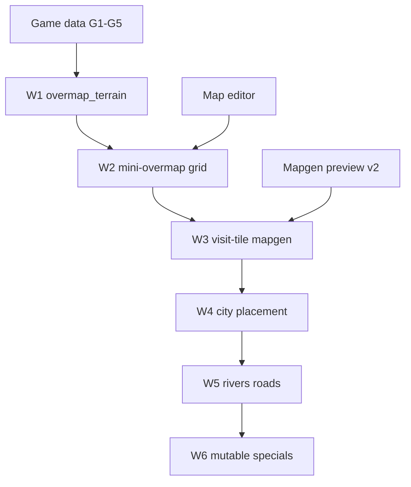

# World generation specification — index and progress

Specs for **BN-style overmap layout + on-demand submap generation** in LibGDX nextgen.

**Implementing?** Start with [implementation-plan.md](./implementation-plan.md) and
[WORLDGEN.md](../WORLDGEN.md).

**Status key:** `todo` · `draft` · `review` · `done`

---

## Consumes

| Upstream | Provides |
| --- | --- |
| [Game data loader](../game-data-loader/README.md) | Terrain/furniture ids (G1–G5) |
| [Mapgen preview](../mapgen-preview/README.md) | `JsonMapgenRunner`, catalogs, bundles |
| [Map editor](../map-editor/README.md) | `MapGrid`, camera, render |
| [Tileset loader](../tileset-loader/README.md) | Sprites |

---

## Does not replace

- **Mapgen preview** — still used for picker import and as the submap engine inside worldgen
- **Full BN parity** — Lua mapgen, every builtin generator, save format, simulation

---

## Worldgen milestones (W1–W6)

| Unit | Topic | PR | Status |
| --- | --- | --- | --- |
| [01](./01-overview-and-scope.md) | Preview vs worldgen; coordinates; BN pipeline | — | draft |
| [02](./02-overmap-terrain-loader.md) | `overmap_terrain` JSON → registry | **W1** | done |
| [03](./03-mini-overmap-grid.md) | Fixed-size OMT grid; editor overmap view | **W2** | done |
| [04](./04-visit-tile-mapgen.md) | Weighted mapgen pick; submap cache | **W3** | done |
| [05](./05-city-and-special-placement.md) | Cities, static `overmap_special` | **W4** | done |
| [06](./06-rivers-roads-connections.md) | Rivers, highways, `overmap_connection` | **W5** | done |
| [07](./07-mutable-specials-and-joins.md) | Procedural specials, joins, phases | **W6** | done |

**Plan:** [implementation-plan.md](./implementation-plan.md)

---

## Post–mapgen-v2 follow-ups (parallel)

These improve preview/worldgen quality but are **not** overmap layout:

| Unit | Topic | Status |
| --- | --- | --- |
| [08](./08-mapgen-post-v2-polish.md) | Parameters, weighted picker, nested neighbors | todo |
| [09](./09-editor-rendering-polish.md) | Multitile, looks_like, overlays — [map-editor v2](../map-editor/v2-implementation-plan.md) | todo |
| [10](./10-game-data-g6-plus.md) | Items, monsters, item groups | todo |
| [11](./11-building-bundle-gaps.md) | Mutable specials in bundles, scan gaps | todo |

---

## Dependency graph

---

## Primary BN data paths

| Path | Role |
| --- | --- |
| `data/json/overmap/overmap_terrain/` | OMT type definitions |
| `data/json/overmap/overmap_connection/` | Road/path templates |
| `data/json/overmap/multitile_city_buildings.json` | City building footprints |
| `data/json/overmap/overmap_special/` | Static special layouts |
| `data/json/overmap/overmap_mutable/` | Procedural special rules |
| `data/json/region_settings/` | Region id for worldgen |
| `data/json/mapgen/` | Submap recipes (via mapgen preview loader) |

---

## Verification (program-wide)

1. W1: `find("house_09")` returns rotatable OMT with mapgen refs
2. W2: 8×8 test overmap displays OMT ids; click selects cell
3. W3: Same OMT + seed → identical 24×24 submap as direct `JsonMapgenRunner` when weights are trivial
4. W4: One city building footprint appears on generated overmap at expected coords
5. W5: River OMT chain connects two water bodies (fixture or BN integration)
6. W6: One mutable lab special assembles multi-OMT layout (stretch goal)
