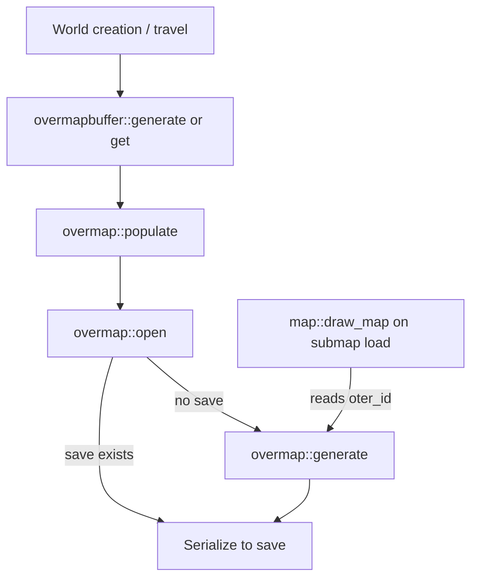

# 01 — Overview and lifecycle

When and how BN generates overmaps and submaps. Orchestration only — phase algorithms are in
[04-generation-pipeline.md](./04-generation-pipeline.md) and sub-units 04a–04d.

---

## Purpose

BN world layout has two scales:

1. **Overmap** — coarse **180×180** OMT grid per file (`OMAPX` × `OMAPY`); each cell stores an
   `oter_id` per z-slice.
2. **Submap** — fine **12×12** tile grid per submap (`SEEX` × `SEEY`); each OMT is **2×2**
   submaps → **24×24** tiles playable at full OMT resolution.

The overmap is generated once (or loaded from save). Submaps are generated lazily and cached in
`mapbuffer`.

---

## Core concepts

### Overmap file vs world

| Concept | Meaning |
| --- | --- |
| Overmap coordinates | `(omx, omy)` — which 180×180 file (`point_abs_om`) |
| OMT coordinates | `(x, y)` within one overmap, `0 … OMAPX-1` |
| World OMT | Absolute position: overmap origin + local OMT (`point_abs_omt`) |

`overmapbuffer` owns loaded/generated overmaps and routes lookups by world position.

### Z layers

`OVERMAP_LAYERS = 1 + OVERMAP_DEPTH + OVERMAP_HEIGHT` (typically **21** layers: z −10 … +10).

Constructor fill (`overmap::init_layers`, ~2978):

| z | Default `oter_id` |
| --- | --- |
| 0 (surface) | `regional_settings::default_oter` (usually `field`) |
| z > 0 | `open_air` |
| z < 0 | `empty_rock` |

Buildings, sewers, lakes, and specials paint other layers during placement.

### Regional settings pointer

Each `overmap` holds `settings` — resolved in constructor (~2882):

```text
region_type = overmapbuffer::current_region_type
           OR (if empty/"default") option DEFAULT_REGION
           OR fallback "default" entry in region_settings_map
```

See [02-regional-settings.md](./02-regional-settings.md).

---

## Lifecycle timeline



### `overmapbuffer::generate`

**Anchor:** `src/overmapbuffer.cpp` **128+**.

- Accepts vector of `point_abs_om` locations
- Skips already-loaded overmaps
- Thread pool: `overmap(loc, dim_id)` → `populate(dim_id)` per loc
- Inserts as futures complete (non-blocking scan)

### `overmap::populate`

**Anchor:** `src/overmap.cpp` **2916–2963**.

1. Build `enabled_specials` from `overmap_specials::get_default_batch`
2. Apply region `overmap_feature_flag` blacklist/whitelist
3. Call `open(dim_id, enabled_specials)`

### `overmap::open`

**Anchor:** `src/overmap.cpp` **6441–6468**.

- **Save exists:** `read_overmap` + `unserialize` — **no** `generate`
- **Else:** fetch neighbor pointers via `get_existing`, call `generate(N,E,S,W,batch)`

Neighbor order documented in [04a-neighbor-stitch.md](./04a-neighbor-stitch.md).

### Skip conditions (`generate`)

| Condition | Line |
| --- | --- |
| `special_game_type::DEFENSE` | ~3397 |
| Dimension `pocket_info` | ~3406 |
| `world_type.generate_overmap == false` | ~3411 |

---

## Seeds and RNG

| Use | Source |
| --- | --- |
| Forest/lake/swamp noise | World seed → `om_noise::*` layers ([appendix](./appendix-algorithms-rng.md)) |
| City count, river walk, special picks | `rng_get_engine()` / `rng()` — order-sensitive |
| Submap mapgen | Mixed seed in `mapgendata` setup |

Noise phases are **deterministic per world seed** and global OMT coordinates. Placement rolls
use the global RNG stream — reordering generate phases changes layouts.

---

## Options affecting layout

From `src/options.cpp` (world category):

| Option | Default | Effect |
| --- | --- | --- |
| `DEFAULT_REGION` | `"default"` | Fallback region id |
| `CITY_SIZE` | 8 | City radius heuristic (`0` disables cities) |
| `CITY_SPACING` | 4 | Coverage `1/2^spacing` of map |
| `SPECIALS_DENSITY` | 1.0 | Special occurrence multiplier |
| `SPECIALS_SPACING` | 6 | Min special separation (-1 allows overlap) |

Rendering-only: `OVERMAP_TILES`.

---

## Save format (brief)

`overmap::save` (~6471): terrain layers, cities, specials, `connections_out`, mongroups.
Per-dimension path via `g->get_active_world()->write_overmap`.

Nextgen W16 deferred — [../22-world-persistence.md](../22-world-persistence.md).

---

## Relationship to nextgen

| BN | Nextgen |
| --- | --- |
| Tiled `overmapbuffer` | Single `OvermapGrid` up to 180×180 |
| Save/load `.sav2` | In-memory only |
| 2×2 submaps per OMT | One `MapGrid` per OMT (or 3×3 stitch) |
| `populate` + region special filter | Partial |

Contract: [../01-overview-and-scope.md](../01-overview-and-scope.md).

---

## Inputs

- World seed, active region id, dimension id
- Neighbor overmap pointers when generating new file
- Game type, dimension/world_type flags

## Outputs

- Populated `map_layer` stacks
- `connections_out`, `cities`, special placement maps
- Serialized overmap when saved

## Failure modes

- Missing `default` region at data load — finalize error (before generate)
- Unknown region id at construct — fallback + `debugmsg`
- Generate skipped — constructor fill only

## Verification

1. New world at `(0,0)` — one `generate start/done` per new overmap; reload skips generate.
2. `DEFAULT_REGION` change — new overmaps use matching `default_oter`.
3. Defense mode — no procedural layout.

**BN anchors:** `src/overmapbuffer.cpp`, `src/overmap.cpp` (`populate`, `open`, `generate`),
`src/worldfactory.cpp`, `src/game_constants.h`.
