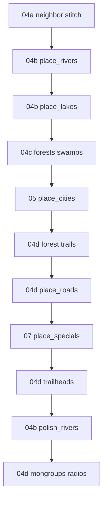

# 04 — Generation pipeline (index)

Orchestration inside `overmap::generate` — phase order, gates, and links to per-phase specs.
Algorithm detail lives in sub-units **04a–04d**; cities in [05-cities-and-urban.md](./05-cities-and-urban.md);
connections API in [06-connections.md](./06-connections.md); specials in [07-specials-and-mutable.md](./07-specials-and-mutable.md).

---

## Entry function

```cpp
void overmap::generate(
    const overmap *north, const overmap *east,
    const overmap *south, const overmap *west,
    overmap_special_batch &enabled_specials );
```

**BN anchor:** `src/overmap.cpp` lines **3393–3450**.

Called from `overmap::open` when no save exists. Neighbor pointers come from
`overmapbuffer::get_existing` in order **(north, east, south, west)** — see [04a](./04a-neighbor-stitch.md).

---

## Early exit (no layout)

| Condition | Source |
| --- | --- |
| `g->gametype() == special_game_type::DEFENSE` | ~3397 |
| Current dimension has `pocket_info` | ~3406 |
| `world_type.generate_overmap == false` | ~3411 |

When skipped, layers remain `init_layers()` fill only (`default_oter` / `open_air` / `empty_rock`).

---

## Phase order (authoritative)

```text
connection_cache = {}
populate_connections_out_from_neighbors(N, E, S, W)     → 04a
place_rivers(N, E, S, W)                                → 04b  (skip if river_scale == 0)
place_lakes()                                           → 04b  (if overmap_lake.noise_threshold_lake > 0)
place_forests(); place_swamps()                         → 04c  (if overmap_forest.noise_threshold_forest > 0)
place_cities()                                          → 05
place_forest_trails()                                   → 04d  (if forest_trail.chance > 0)
place_roads(N, E, S, W)                                 → 04d / 06
place_specials(enabled_specials)                        → 07
place_forest_trailheads()                               → 04d  (if forest_trail.chance > 0)
polish_rivers(N, E, S, W)                               → 04b
place_mongroups(); place_radios()                       → 04d (gameplay, not terrain art)
connection_cache.reset()
```



---

## Regional gates (quick reference)

| Phase | Skip when |
| --- | --- |
| Rivers | `settings->river_scale == 0.0` |
| Lakes | `overmap_lake.noise_threshold_lake <= 0` |
| Forests + swamps | `overmap_forest.noise_threshold_forest <= 0` |
| Cities | `CITY_SIZE` (or region `city_size`) `<= 0` |
| Forest trails / trailheads | `forest_trail.chance <= 0` |

See [02-regional-settings.md](./02-regional-settings.md) for JSON fields.

---

## Sub-units

| Unit | File | Topics |
| --- | --- | --- |
| 04a | [04a-neighbor-stitch.md](./04a-neighbor-stitch.md) | `connections_out`, `connection_cache`, `open` neighbor fetch |
| 04b | [04b-hydrology.md](./04b-hydrology.md) | `place_rivers`, `place_river`, `place_lakes`, `polish_rivers` |
| 04c | [04c-terrain-fill.md](./04c-terrain-fill.md) | `place_forests`, `place_swamps`, `om_noise` layers |
| 04d | [04d-roads-trails-post.md](./04d-roads-trails-post.md) | `place_roads`, forest trails, trailheads, mongroups |

---

## `connection_cache` lifetime

Created empty at generate start (~3420), used by `build_connection` to track partial layouts during
carve, cleared at end (~3447). Required for consistent multi-segment routes within one generate pass.

---

## Nextgen comparison

| BN | Nextgen |
| --- | --- |
| Multi-file neighbor stitch (`overmapbuffer`) | Single grid; no cross-file `connections_out` |
| `place_roads` → `local_road` only (no separate highway pass in C++) | `HighwayGenerator` connects city centers (W17c — **nextgen-only**) |
| `place_specials` before `polish_rivers` | Same order in `OvermapGenerator` |
| `river_scale == 0` disables rivers | Partial — check `RegionProfile` |

Gap inventory: [../24-cdda-layout-gaps.md](../24-cdda-layout-gaps.md).

---

## Inputs

- Initialized `map_layer` stacks (`init_layers` / `default_oter`)
- `regional_settings` thresholds and `city_spec`
- Neighbor overmap pointers (may be null)
- `enabled_specials` batch (filtered in `populate` from region whitelist/blacklist)

## Outputs

- Mutated `map_layer` at all z touched by phases
- `connections_out` edge endpoints per `overmap_connection_id`
- `cities` vector
- `overmap_special_placements` map
- `connection_cache` cleared

## Failure modes

- Early return for defense / pocket / `generate_overmap=false`
- Missing connection template → phase skips subset (`debugmsg` from `build_connection`)
- Special placement failure → attempt discarded; generate continues

## Verification

1. Debug log: `overmap::generate start` then `done` once per new overmap file.
2. Phase order: rivers and lakes before cities; `polish_rivers` after specials.
3. Set `river_scale` to `0` in region JSON — no `river_*` OMT ids except neighbor stitch copies.

**BN anchors:** `src/overmap.cpp` (`generate`, `open` ~6441, `populate` ~2916).
