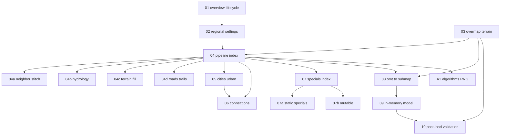

# BN overmap / worldgen specification — index and progress

Language-agnostic documentation extracted from **Cataclysm: Bright Nights** C++ for
understanding and reimplementing overmap layout and submap generation. Each unit is a
self-contained spec: inputs, outputs, failure modes, and source references in the BN repo.

**Implementing in nextgen?** Start with [implementation-plan.md](./implementation-plan.md).
Nextgen milestone contracts live in the parent [worldgen/](../README.md) index (W1–W17).

**Status key:** `todo` · `draft` · `review` · `done`

---

## Audience split

| Tree | Purpose |
| --- | --- |
| `docs/worldgen/reference/` (this folder) | **BN source truth** — what `overmap::generate` and friends actually do |
| `docs/worldgen/` (parent) | **Nextgen contracts** — PR slices, Java APIs, verification for the port |

Do not duplicate nextgen milestone tables here. Cross-link instead.

---

## Project scope

### In scope

- Overmap lifecycle: when generation runs, seeds, save/load, neighbor stitching
- Regional settings JSON and runtime `regional_settings`
- Overmap terrain (`overmap_terrain`) registry, flags, mapgen links
- `overmap::generate` phase order and major algorithms
- Cities, local roads, rivers, lakes, forests, swamps, trails
- `overmap_connection` templates and carving
- Static and mutable `overmap_special` placement
- OMT → submap: `map::draw_map`, JSON vs builtin mapgen
- In-memory types: `overmap`, `map_layer`, `oter_id`, `connections_out`
- Post-load validation passes

### Out of scope

| Topic | Notes |
| --- | --- |
| Draw-time overmap rendering | Consumer of `oter_id`; see `src/cata_tiles.cpp` overmap path |
| Full simulation (mongroups, radios gameplay) | Listed for pipeline completeness; not layout art |
| Lua mapgen authoring guide | See BN mod docs; reference only notes pick path |
| Nextgen Java module map | See parent `implementation-plan.md` and W-unit docs |
| Mapgen JSON field grammar | See [mapgen-preview](../../mapgen-preview/README.md) |

### Primary BN source files

| Area | Files |
| --- | --- |
| Orchestration | `src/overmapbuffer.cpp`, `src/overmap.cpp` (`populate`, `open`, `generate`) |
| Layout phases | `src/overmap.cpp` (`place_*`, `build_connection`, `polish_rivers`) |
| Region | `src/regional_settings.h`, `src/regional_settings.cpp` |
| OMT data | `src/omdata.h`, `src/overmap.cpp` (`overmap_terrains`) |
| Connections | `src/overmap_connection.h`, `src/overmap_connection.cpp` |
| Specials | `src/overmap_special.h`, mutable logic in `src/overmap.cpp` |
| Submap | `src/mapgen.cpp` (`map::draw_map`, `oter_mapgen`) |
| Noise | `src/overmap_noise.h`, `src/overmap_noise.cpp` |
| Constants | `src/game_constants.h` (`OMAPX`, `OVERMAP_DEPTH`, `SEEX`) |
| World UI | `src/worldfactory.cpp`, `src/options.cpp` |

### Scale (BN defaults)

| Symbol | Typical value |
| --- | --- |
| Overmap OMT grid | `OMAPX` × `OMAPY` = **180 × 180** per overmap file |
| Z layers | `OVERMAP_LAYERS` = 21 (z −10 … +10) |
| Submap | `SEEX` × `SEEY` = **12 × 12** tiles |
| OMT (playable) | 2 × 2 submaps = **24 × 24** tiles |
| Overmap files | Tiled world: one save blob per 180×180 region |

---

## Unit map

---

## Progress

| Unit | File | Status | Depends on |
| --- | --- | --- | --- |
| 01 | [01-overview-and-lifecycle.md](./01-overview-and-lifecycle.md) | draft | — |
| 02 | [02-regional-settings.md](./02-regional-settings.md) | draft | 01 |
| 03 | [03-overmap-terrain.md](./03-overmap-terrain.md) | draft | 01 |
| 04 | [04-generation-pipeline.md](./04-generation-pipeline.md) | draft | 02, 03 |
| 04a | [04a-neighbor-stitch.md](./04a-neighbor-stitch.md) | draft | 04 |
| 04b | [04b-hydrology.md](./04b-hydrology.md) | draft | 04 |
| 04c | [04c-terrain-fill.md](./04c-terrain-fill.md) | draft | 04 |
| 04d | [04d-roads-trails-post.md](./04d-roads-trails-post.md) | draft | 04, 06 |
| 05 | [05-cities-and-urban.md](./05-cities-and-urban.md) | draft | 04 |
| 06 | [06-connections.md](./06-connections.md) | draft | 03, 04 |
| 07 | [07-specials-and-mutable.md](./07-specials-and-mutable.md) | draft | 04 |
| 07a | [07a-static-specials.md](./07a-static-specials.md) | draft | 07 |
| 07b | [07b-mutable-specials.md](./07b-mutable-specials.md) | draft | 07 |
| 08 | [08-omt-to-submap.md](./08-omt-to-submap.md) | draft | 03, 04 |
| 09 | [09-in-memory-model.md](./09-in-memory-model.md) | draft | 08 |
| 10 | [10-post-load-validation.md](./10-post-load-validation.md) | draft | 03 |
| A1 | [appendix-algorithms-rng.md](./appendix-algorithms-rng.md) | draft | 04 |
| — | [implementation-plan.md](./implementation-plan.md) | draft | 01–10 |

---

## Unit definitions

Each unit doc ends with:

1. **Inputs** — what the step receives
2. **Outputs** — what it produces or mutates
3. **Failure modes** — errors, warnings, fallbacks
4. **Verification** — how to confirm understanding or port fidelity

---

## Changelog

| Date | Change |
| --- | --- |
| 2026-07-08 | Initial reference index |
| 2026-07-08 | Expanded all units from BN C++ sources; split 04 → 04a–d, 07 → 07a–b |
