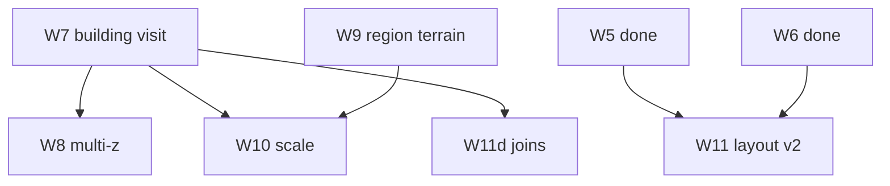

# Implementation plan — world generation v2

Agent-oriented guide for **worldgen after W1–W6**. Unit specs: [README](./README.md) units
12–17; roadmap [12-v2-parity-roadmap](./12-v2-parity-roadmap.md).

---

## Goal

**Visit a procedurally placed building on the overmap and see the same quality as mapgen picker
import** — multi-floor volumes, stitch, spawns, floor cycling — then scale layout and region
fidelity toward BN.

### First success criterion (W7)

Generate 16×16 overmap → click `2storyModern01` or `lab_mutagen` OMT → editor shows `MapVolume`
with floor UI and spawn overlay (matches picker).

### Second success criterion (W8)

Visit basement / roof OMT or change z → correct mapgen for that z-level.

### Third success criterion (W10)

64×64 overmap generates and pans at interactive frame rate after viewport culling.

---

## v1 recap (done)

W1–W6 deliver mini-overmap generation and single-piece visit. See
[implementation-plan.md](./implementation-plan.md).

| v1 simplification | v1 implementation | v2 target |
| --- | --- | --- |
| Visit = one `JsonMapgenDefinition` | `SubmapGenerator.visit` → `MapgenPicker` | W7: `MapVolumeBuilder` for building OMTs |
| z=0 only | `MapgenPicker.pick(omtId, 0, …)` in most paths | W8: z-aware pick + cache |
| `default` region + forest/field noise | `BaseTerrainFiller` | W9: `regional_map_settings.json` |
| 8×8–16×16 overmap | `MapEditorScreen.cycleOvermapSize` | W10: 64×64 → 180×180 |
| One river, MST roads, small mutable | W5–W6 | W11: layout passes closer to BN |
| Placement not recorded | `placedCenters` for roads only | W7: `PlacedBuildingIndex` |

**Key v1 files:**

```text
worldgen/generate/OvermapGenerator.java
worldgen/generate/CityPlacer.java
worldgen/submap/SubmapGenerator.java
worldgen/WorldgenPreviewService.java
view/MapEditorScreen.java  — visitSelectedOmtLoaded, applyBuildingImport
```

---

## Dependencies

| Upstream | Provides |
| --- | --- |
| W1–W6 | `OvermapGenerator`, `SubmapGenerator`, mutable assembler |
| [Mapgen preview v2](../mapgen-preview/v2-implementation-plan.md) | `MapVolumeBuilder`, runner, nested, stitch, spawns |
| [Map editor M1–M4](../map-editor/implementation-plan.md) | `MapVolume`, floor cycling, overlays |
| [Game data G6+](./10-game-data-g6-plus.md) | Item/monster groups for spawn overlay |
| [Regional terrain P11](../mapgen-preview/19-regional-terrain.md) | `RegionContext` pattern for W9 |

---

## PR dependency graph

```text
W6 (done) ──► W7 building-aware visit (+ placement index on generate)
W7 ──────────► W8 multi-z visit (buildings need volume context)
W4 (done) ──► W9 region terrain (generator already has regionId stub)
W7 + W9 ─────► W10 scale (quality before size)
W5 + W6 ─────► W11 procedural layout v2 (rivers, roads, mutable phases)
W7 ──────────► W11d join context (placement index)
```



---

## Deliverables by PR

### W7 — Building-aware visit

**Problem:** `visitSelectedOmtLoaded` clears `mapVolume` and runs single-mapgen path.

**Spec:** [13](./13-building-aware-visit.md)

#### New / extended types

| Class | Responsibility |
| --- | --- |
| `PlacedBuildingRecord` | `buildingId`, anchor `(x,y)`, rotation, footprint, `placementKind` |
| `PlacedBuildingIndex` | Spatial query: `findAt(omtX, omtY)` → optional record |
| `BuildingVisitResolver` | Map record + z + omtId → `CityBuildingDefinition` + active floor |
| `VolumeCache` | LRU cache keyed by `(seed, buildingId, anchor)` |
| `VisitResult` (extend) | Optional `MapVolume`, `spawnMarkersByZ`, `activeBuilding` |
| `OvermapGenerateResult` (extend) | Carry `PlacedBuildingIndex` from generate |
| `CityPlacer` / `MutableSpecialPlacer` | Emit records during blit |
| `SubmapGenerator` | Branch: volume path vs `MapgenPicker` |
| `WorldgenPreviewService` | Store placement index; pass to visit |
| `MapEditorScreen` | `setMapVolume` after overmap visit (mirror `applyBuildingImport`) |

#### Implementation steps

```text
1. PlacedBuildingRecord + PlacedBuildingIndex (immutable after generate)
2. CityPlacer / StaticSpecialPlacer / MutableSpecialPlacer → add records
3. OvermapGenerator → build index; OvermapGenerateResult.getPlacementIndex()
4. WorldgenPreviewService.generateOvermap → retain index
5. SubmapGenerator.visit(..., placementIndex, volumeCache)
      → if record: MapVolumeBuilder.build → VisitResult.forBuilding(...)
      → else: existing path
6. MapEditorScreen.visitSelectedOmtLoaded → setMapVolume when result has volume
7. Fixtures: 16×16 grid with one house + one lab cell
```

#### Tests

| Test | Assert |
| --- | --- |
| `PlacedBuildingIndexTest` | `findAt` inside footprint; empty outside |
| `BuildingVisitResolverTest` | lab anchor → full `CityBuildingDefinition` |
| `SubmapGeneratorBuildingTest` | visit lab cell → grid larger than 24×24 or multi-z markers |
| `OvermapGeneratorPlacementTest` | generate places ≥1 building; index non-empty |

#### Manual smoke

1. `gradlew.bat lwjgl3:run` → Map Editor
2. Load BN data + tileset
3. `M` overmap mode → generate 16×16
4. Click house OMT → `[`/`]` cycles floors; spawn overlay shows markers
5. Compare same building via `Ctrl+G` picker — grids should match (same seed options)

---

### W8 — Multi-z visit

**Spec:** [14](./14-multi-z-visit.md)

| Class | Responsibility |
| --- | --- |
| `MapgenPicker` (extend) | Filter defs by z; `_roof` / `_basement` suffix heuristics |
| `ZLevelResolver` | Map visit z + omtId → volume floor index |
| `SubmapGenerator` | z in `SubmapKey` (already); volume active z from visit |
| `SubmapCache` | Separate cache entries per z |
| `MapEditorScreen` | z selector or `[`/`]` when visiting from overmap without volume |
| `WorldgenPreviewService.visit` | Accept `z` parameter |

#### Tests

| Test | Assert |
| --- | --- |
| `MapgenPickerZTest` | `house_09_basement` picks basement def when z&lt;0 |
| `ZLevelResolverTest` | roof OMT → top volume floor |
| `SubmapGeneratorZTest` | same (x,y), z=0 vs z=-1 → different grids |

---

### W9 — Region-driven base terrain

**Spec:** [15](./15-region-settings-terrain.md)

**Data path:** `data/json/regional_map_settings.json` (array of `type: region_settings`), **not**
a `region_settings/` directory.

| Class | Responsibility |
| --- | --- |
| `RegionSettingsLoader` | Parse BN region_settings objects by id |
| `RegionTerrainWeights` | OMT type weights for `BaseTerrainFiller` |
| `RegionCitySettings` | Building / special weights (subset) |
| `BaseTerrainFiller` | Use weights + lake noise threshold from region |
| `OvermapGenerator` | Read `regionId` from options; pass to fill + placers |

Reuse patterns from mapgen preview `RegionContext` / `RegionalTerrainResolver` where possible —
different JSON sections (`overmap_terrain_settings` vs `terrain`).

#### Tests

| Test | Assert |
| --- | --- |
| `RegionSettingsLoaderTest` | loads `default` from fixture JSON |
| `BaseTerrainFillerRegionTest` | high forest weight → more `forest` OMT ids |
| Optional integration | sibling `../Cataclysm-BN/data/json/regional_map_settings.json` |

---

### W10 — Overmap scale and performance

**Spec:** [16](./16-overmap-scale.md)

**Gate:** Do not land W10 before W7 visit quality is acceptable on 16×16.

| Class | Responsibility |
| --- | --- |
| `MapEditorScreen.drawOvermapGrid` | Viewport culling (visible OMT range only) |
| `OvermapGenerateOptions` | `preview64()`, `bnScale()` preset quotas |
| `SubmapCache` | Configurable max entries |
| `WorldgenPreviewService` | `setSubmapCacheCapacity` |
| `OvermapGrid` | Keep dense array through 180×180 unless profiling says otherwise |

#### Tests

| Test | Assert |
| --- | --- |
| `OvermapGeneratorScaleTest` | 64×64 generate; all cells non-null |
| `OvermapGridTest` | 180×180 alloc + random access |

#### Manual

64×64 pan/zoom; visit (0,0) and corner cell.

---

### W11 — Procedural layout v2

**Spec:** [17](./17-procedural-layout-v2.md)

Incremental BN `overmap::generate` parity — **one sub-topic per PR**:

| Sub-PR | Topic | Primary touch |
| --- | --- | --- |
| W11a | Multi-phase mutable + rotation | `SpecialPhaseAssembler` |
| W11b | Lakes + river hydrology | `LakeGenerator`, `RiverGenerator` |
| W11c | Connection-aware roads | `HighwayGenerator`, `OvermapConnectionRegistry` |
| W11d | `activeJoins` → nested mapgen | `JoinContext`, `SubmapGenerator` |

Each sub-PR: own branch, own tests, update [17](./17-procedural-layout-v2.md) status.

---

## PR checklist

| PR | Compile | Unit tests | Manual smoke |
| --- | --- | --- | --- |
| W7 | ✓ | building visit tests | overmap click → multi-floor house |
| W8 | ✓ | z picker tests | basement visit differs from ground |
| W9 | ✓ | region loader tests | `default` region changes field/forest ratio |
| W10 | ✓ | scale smoke test | 64×64 pan/zoom usable |
| W11 | ✓ | per sub-PR | lab multi-phase on 32×32 |

Each PR:

```bash
gradlew.bat compileJava
gradlew.bat :core:test
```

---

## Package layout (additions)

```text
core/src/main/java/io/gdx/cdda/bn/nextgen/worldgen/
  placement/
    PlacedBuildingRecord.java
    PlacedBuildingIndex.java
    PlacementKind.java
  visit/
    BuildingVisitResolver.java
    VolumeCache.java
    VolumeCacheKey.java
    ZLevelResolver.java          # W8
  region/
    RegionSettingsLoader.java    # W9
    RegionTerrainWeights.java
  submap/
    SubmapGenerator.java         # extend W7/W8/W11d
    VisitResult.java             # extend fields
  generate/
    OvermapGenerateResult.java   # extend W7
    LakeGenerator.java           # W11b
```

Test fixtures:

```text
core/src/test/resources/worldgen-fixtures/
  overmap-16x16-house-placement.json   # W7
  region-default-minimal.json          # W9
```

---

## Agent workflow

1. Read [WORLDGEN.md](../WORLDGEN.md) and the **unit doc** for the PR (13–17)
2. Read [12-v2-parity-roadmap](./12-v2-parity-roadmap.md) gap row for context
3. Implement **one W slice**; call `MapVolumeBuilder` / `JsonMapgenRunner` — do not fork runner
4. Extend `OvermapGenerateResult` / placers if the PR needs placement data
5. Add fixture under `core/src/test/resources/worldgen-fixtures/`
6. Run `gradlew.bat :core:test`
7. Manual smoke in map editor when UI-touching
8. Update unit doc **Status** (`todo` → `done`) when merged

### W7 starter prompt (for agents)

> Implement W7 per `docs/worldgen/13-building-aware-visit.md`. Add `PlacedBuildingIndex`
> during `OvermapGenerator.generate`, extend `SubmapGenerator.visit` to use
> `MapVolumeBuilder` when the clicked cell is inside a placed footprint, and wire
> `MapEditorScreen.visitSelectedOmtLoaded` to call `setMapVolume` instead of clearing it.

---

## v2 out of scope

| Topic | Notes |
| --- | --- |
| `.sav2` persistence | Separate track |
| Full `mapbuffer` 2×2 submaps per OMT | Defer past W10 |
| Builtin / Lua mapgen | Warn + skip |
| Avatar, NPCs, item simulation | Game client |
| Full BN hydrology | W11b subset only |
| GPU instanced OMT rendering | W10 uses culling only |

---

## Related docs

| Doc | Role |
| --- | --- |
| [12-v2-parity-roadmap](./12-v2-parity-roadmap.md) | Gap inventory |
| [13–17](./README.md) | Unit algorithms |
| [implementation-plan.md](./implementation-plan.md) | W1–W6 (done) |
| [WORLDGEN.md](../WORLDGEN.md) | Top-level guide |
