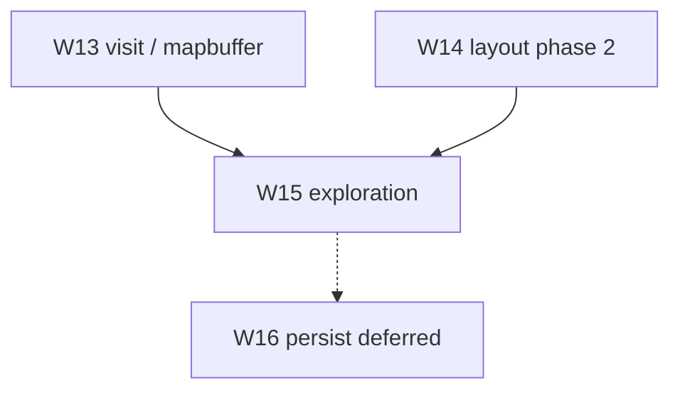

# Implementation plan — world generation v3

Agent-oriented guide for **worldgen after v2 (W7–W11)**. Unit specs: [README](./README.md) units
18–22; roadmap [18-world-map-v3-roadmap](./18-world-map-v3-roadmap.md).

---

## Goal

**Navigate a generated BN-scale overmap with trustworthy submaps at every OMT, layout that
reflects region data, and exploration state — all in memory (no save file in v3 phase 1).**

### First success criterion (W13)

Visit corner OMT of a multitile house on 64×64 overmap → grid matches mapgen picker import for
that cell (rotation, stitch, nested context).

### Second success criterion (W14)

Change `regionId` on same seed → different special/terrain mix (not just forest/lake ratio).

### Third success criterion (W15)

Unvisited OMTs render dimmed; revisiting a cell hits `SubmapCache`; HUD shows `(omx, omy, z)`.

### Deferred (W16)

Save/load world JSON — see [22-world-persistence](./22-world-persistence.md). **Do not start W16**
until W15 exploration model exists.

---

## v2 recap (done)

See [v2-implementation-plan](./v2-implementation-plan.md). Key files:

```text
worldgen/generate/OvermapGenerator.java
worldgen/submap/SubmapGenerator.java
worldgen/mutable/JoinContext.java
worldgen/placement/PlacedBuildingIndex.java
worldgen/visit/ZLevelResolver.java
view/MapEditorScreen.java
```

---

## PR dependency graph

```text
W11 (done) ──► W13 visit fidelity
W9  (done) ──► W14 layout parity phase 2
W10 (done) ──► W13 + W15 (scale stress)
W13 + W14 ───► W15 exploration (cache + coords)
W15 ─────────► W16 persistence (deferred)
```



---

## Deliverables by PR

### W13 — Visit / mapbuffer fidelity

**Spec:** [19](./19-visit-mapbuffer-fidelity.md)

| Sub-PR | Scope |
| --- | --- |
| W13a | Stitch audit + edge fixes without mapbuffer |
| W13b | `Mapbuffer` model (2×2 submaps per OMT) if required |
| W13c | Nested `connections` context at visit |

**Primary touch:** `SubmapGenerator`, `MapVolumeBuilder`, `NestedContextChecker`, new `map/` types if W13b.

---

### W14 — Layout parity phase 2

**Spec:** [20](./20-layout-parity-phase2.md)

| Sub-PR | Scope |
| --- | --- |
| W14a | `overmap_special_settings` from region |
| W14b | `city_size` / urban spacing |
| W14c | Swamp, beach, thick forest region passes |

**Primary touch:** `RegionSettingsLoader`, `OvermapGenerator`, new placer passes.

---

### W15 — Exploration & world coordinates

**Spec:** [21](./21-exploration-and-world-coords.md)

| Sub-PR | Scope |
| --- | --- |
| W15a | `ExplorationState` + overmap dim/highlight |
| W15b | `WorldCoord` + editor move-between-OMT |

**Primary touch:** `WorldgenSession` (new), `MapEditorScreen`, `SubmapCache` policy hooks.

---

### W16 — World persistence (deferred)

**Spec:** [22](./22-world-persistence.md) — **not in v3 phase 1.**

---

## PR checklist

| PR | Compile | Unit tests | Manual smoke |
| --- | --- | --- | --- |
| W13 | ✓ | stitch + nested connection tests | Corner OMT vs picker |
| W14 | ✓ | region special/city tests | Region switch on 32×32 |
| W15 | ✓ | exploration flag tests | Dim unseen; revisit cache |
| W16 | — | deferred | — |

Each PR:

```bash
gradlew.bat compileJava
gradlew.bat :core:test
```

---

## Package layout (additions)

```text
core/src/main/java/io/gdx/cdda/bn/nextgen/worldgen/
  mapbuffer/          # W13b — if mapbuffer lands
    Mapbuffer.java
    SubmapCoord.java
  region/
    OvermapSpecialSettings.java   # W14a
    CitySizeSettings.java         # W14b
  explore/
    ExplorationState.java         # W15a
    WorldCoord.java               # W15b
  session/
    WorldgenSession.java          # W15 — ties grid + exploration + placement
```

Test fixtures:

```text
core/src/test/resources/worldgen-fixtures/
  multitile-corner-visit.json     # W13
  region-special-heavy.json       # W14
```

---

## Agent workflow

1. Read [WORLDGEN.md](../WORLDGEN.md) and the **unit doc** for the PR (19–21)
2. Read [18-world-map-v3-roadmap](./18-world-map-v3-roadmap.md) gap row
3. Implement **one sub-PR**; reuse `JsonMapgenRunner` / `MapVolumeBuilder`
4. Add fixture + JUnit tests per unit doc **Verification**
5. Run `gradlew.bat :core:test`
6. Manual smoke in map editor when UI-touching
7. Update unit doc **Status** when merged

---

## v3 out of scope

| Topic | Notes |
| --- | --- |
| W16 persistence | Deferred by product choice |
| `.sav2` | Separate track |
| Multi-overmap world grid | v4+ |
| Full subway/rail graph | W14c optional or v4 |
| Lua mapgen | Unless W13c scope expands |

---

## Related docs

| Doc | Role |
| --- | --- |
| [18-world-map-v3-roadmap](./18-world-map-v3-roadmap.md) | Gap inventory |
| [19–21](./README.md) | Unit algorithms |
| [22-world-persistence](./22-world-persistence.md) | Deferred W16 |
| [12-v2-parity-roadmap](./12-v2-parity-roadmap.md) | Prior phase |
