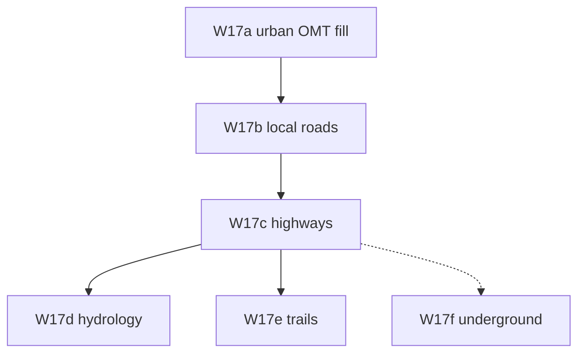

# Implementation plan — world generation v4 (Tier A)

Agent-oriented guide for **Tier A overmap layout** after v3 (W13–W16). Unit spec:
[26-tier-a-urban-layout](./26-tier-a-urban-layout.md). Roadmap:
[27-world-map-v4-roadmap](./27-world-map-v4-roadmap.md).

---

## Goal

**Generated overmaps look like BN towns** — urban blobs with shops/parks/houses, local streets,
and highways between cities — not isolated multitile buildings with MST roads in wilderness.

### First success criterion (W17a)

64×64 overmap, `regionId: "default"`, fixed seed → `overmap_export.json` `rows` contain shop/park
OMT ids (`s_gas`, `park`, `urban_*`, etc.) inside an urban blob.

### Second success criterion (W17b)

Same seed after W17b → connected `road_*` grid inside city radius (not only inter-city spurs).

### Third success criterion (W17c)

Highways connect **city centers**; `OvermapGenerator` runs roads before static/mutable specials
(non-legacy order). Wilderness between cities remains mostly field/forest.

### Tier A complete

Manual smoke: map editor overmap mode “reads as CDDA” vs pre-W17 export on same seed.

---

## Prerequisites (done)

| PR | Provides |
| --- | --- |
| W9 | `RegionSettingsLoader`, `BaseTerrainFiller` |
| W14b | `CitySitePicker`, `CitySizeSettings` |
| W5/W11c | `HighwayGenerator`, `OvermapConnectionRegistry` |
| W13 | Visit stitch (unchanged by W17; urban OMTs use mapgen pick) |

**Parallel (not blocking W17):** W15 exploration, W16 persistence.

---

## PR dependency graph

```text
W14b (done) ──► W17a urban fill
W17a ─────────► W17b local roads
W17b ─────────► W17c highways + reorder
W17c ─────────► W17d hydrology (optional)
W17c ─────────► W17e trails (optional)
W17c -.───────► W17f underground (optional)
```



---

## Deliverables by PR

### W17a — Urban OMT fill

**Spec:** [26 § W17a](./26-tier-a-urban-layout.md#w17a--urban-omt-fill)

| Task | Detail |
| --- | --- |
| Loader | `city.shops`, `city.parks`, `city.finales` → `CityContentWeights` |
| Placer | `UrbanOmtPlacer` — weighted 1×1 OMTs in blob |
| Orchestrator | `CityGenerator.placeAll` replaces sparse-only `CityPlacer` loop |
| Multitile | Keep ≤1 large bundle per blob; lower global quota reliance |

**Primary touch:** `RegionSettingsLoader`, `RegionSettingsDefinition`, `CityGenerator`,
`UrbanOmtPlacer`, `OvermapGenerator`.

---

### W17b — Local road grid

**Spec:** [26 § W17b](./26-tier-a-urban-layout.md#w17b--in-city-local-road-grid)

| Task | Detail |
| --- | --- |
| Model | `UrbanSite` with center + radius |
| Carve | `LocalRoadGenerator` using `local_road` connection |
| Wire | After W17a in `OvermapGenerator` |

**Primary touch:** `LocalRoadGenerator`, `UrbanSite`, `OvermapConnectionRegistry` fixtures.

---

### W17c — Inter-city highways

**Spec:** [26 § W17c](./26-tier-a-urban-layout.md#w17c--inter-city-highways--reorder)

| Task | Detail |
| --- | --- |
| API | `HighwayGenerator.connectCities(List<UrbanSite> ...)` |
| Reorder | Cities → local roads → highways → specials |
| Sites | Stop MST over every mutable/static center for highways |

**Primary touch:** `HighwayGenerator`, `OvermapGenerator`.

---

### W17d — Hydrology v2 (P1)

**Spec:** [26 § W17d](./26-tier-a-urban-layout.md#w17d--hydrology-v2-p1)

| Task | Detail |
| --- | --- |
| Multi-pass | Second `RiverGenerator.carve` with `SECOND_PASS_SEED_XOR` |
| Polish | `RiverPolisher.smooth` — orphan centers, perpendicular spurs, orphan banks |
| Wire | Non-legacy hydrology block in `OvermapGenerator` |

**Primary touch:** `RiverGenerator`, `RiverPolisher`, `OvermapGenerator`.

---

### W17e — Forest trails (P2) ✓

**Spec:** [26 § W17e](./26-tier-a-urban-layout.md#w17e--forest-trails-p2)

`ForestTrailSettings` + `ForestTrailGenerator` after mutable specials; `forest_trails` test region.

### W17f — Underground networks (P2) ✓

**Spec:** [26 § W17f](./26-tier-a-urban-layout.md#w17f--subways--rails--sewers-p2)

`UndergroundNetworkSettings` + `SubwayGenerator` / `RailGenerator` / `SewerGenerator`; `underground_networks` preview region.

---

## PR checklist

| PR | Compile | Unit tests | Manual smoke |
| --- | --- | --- | --- |
| W17a | ✓ | loader + `UrbanOmtPlacerTest`, `CityGeneratorTest` | Export `urban_heavy` shows shop/park ids |
| W17b | ✓ | `LocalRoadGeneratorTest`, `CityGeneratorTest` | Roads inside blob |
| W17c | ✓ | `HighwayGeneratorCityTest`, `OvermapGeneratorOrderTest` | Highways town-to-town |
| W17d | ✓ | `RiverGeneratorMultiTest`, `RiverPolisherTest` | Optional |
| W17e | ✓ | `ForestTrailGeneratorTest`, `RegionSettingsLoaderTest` | Optional |
| W17f | ✓ | `UndergroundNetworkGeneratorTest`, `RegionSettingsLoaderTest` | Optional |

Each PR:

```bash
gradlew.bat compileJava
gradlew.bat :core:test
```

---

## Package layout (additions)

```text
core/src/main/java/io/gdx/cdda/bn/nextgen/worldgen/
  region/
    CityContentWeights.java         # W17a
  generate/
    CityGenerator.java              # W17a
    UrbanOmtPlacer.java             # W17a
    UrbanSite.java                  # W17b
    CityTier.java                   # W17a
    LocalRoadGenerator.java         # W17b
    RiverPolisher.java              # W17d
    ForestTrailGenerator.java       # W17e
    ConnectionPathGenerator.java    # W17f
    SubwayGenerator.java            # W17f
    RailGenerator.java              # W17f
    SewerGenerator.java             # W17f
    UndergroundNetworkGenerator.java # W17f
```

Test fixtures:

```text
core/src/test/resources/worldgen-fixtures/
  urban-heavy-region.json           # W17a
  local-road-connection.json        # W17b (minimal overmap_connection)
```

Integration: prefer BN sibling `regional_map_settings.json` + `overmap_terrain` when
`DataPaths` resolves `../Cataclysm-BN/data/`.

---

## Agent workflow

1. Read [WORLDGEN.md](../WORLDGEN.md) and [26-tier-a-urban-layout](./26-tier-a-urban-layout.md)
2. Read BN `place_cities` / `place_roads` for the slice you implement (do not port wholesale)
3. Implement **one sub-PR** (W17a, then b, then c)
4. Add fixture + JUnit per unit doc **Verification**
5. Run `gradlew.bat :core:test`
6. Manual: **M** → **R** → **Ctrl+Shift+C**; compare `maps/overmap_export.json` to pre-W17 baseline
7. Update unit doc **Status** when merged

---

## v4 out of scope

| Topic | Notes |
| --- | --- |
| Neighbor overmap stitching | [24-cdda-layout-gaps](./24-cdda-layout-gaps.md) Tier C |
| W16 persistence | Parallel track |
| Full BN `place_cities` | W17 is incremental subset |
| Region picker UI | Tier B — [25](./25-cdda-region-visit-world-gaps.md) |
| Builtin / Lua mapgen | Tier B |

---

## Related docs

| Doc | Role |
| --- | --- |
| [27-world-map-v4-roadmap](./27-world-map-v4-roadmap.md) | Phase overview |
| [26-tier-a-urban-layout](./26-tier-a-urban-layout.md) | Algorithms + types |
| [23–25](./README.md) | CDDA parity inventory |
| [v3-implementation-plan](./v3-implementation-plan.md) | Prior phase (W13–W16) |
